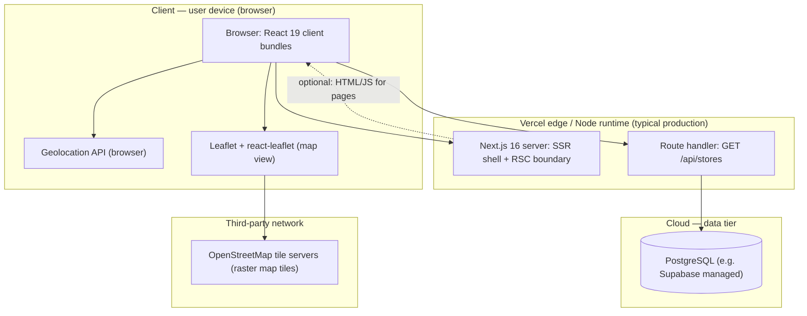
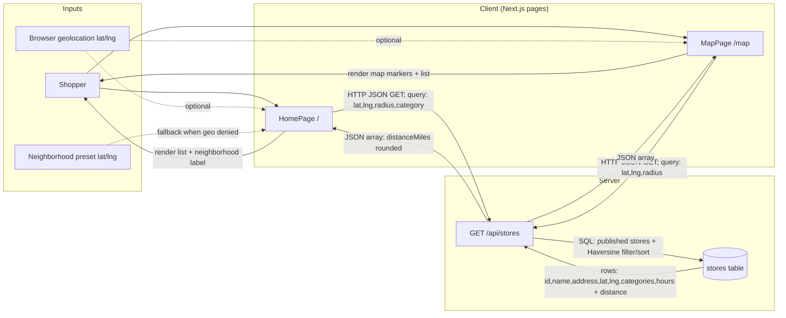
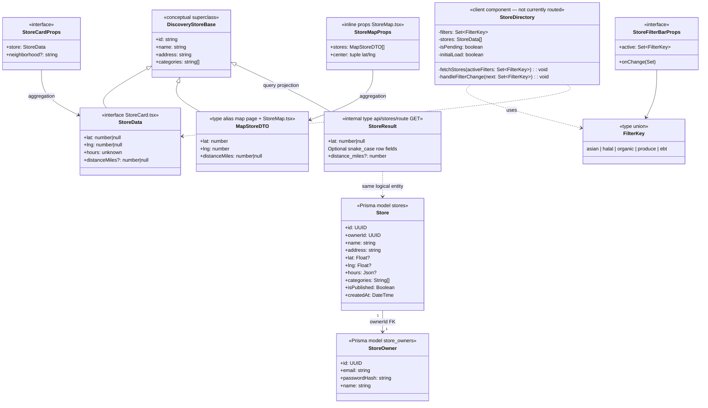

# Dev spec: US 3 — Discover Nearby Stores

**User story:** As a shopper, I want to see a list/map of nearby local grocery stores so that I can discover neighborhood options I did not know existed.

**Single source:** This file is the consolidated dev spec for US 3 (architecture, flows, types, storage, failure analysis, PII).

---

## Ownership & merge metadata

| Item | Value |
|------|--------|
| **Primary story owner** | Evelyn Lui|
| **Secondary story owner** | Eric Du |
| **Date code merged to `main`** | "2026-03-23T20:41:53Z" |

---

## Implementation note (classes vs TypeScript)

The GrocerEase codebase implements US 3 with **React function components**, **route handlers**, and **TypeScript `interface` / `type` aliases**. There are **no ECMAScript `class` declarations** in the US 3 paths inspected (`grep '^class '` is empty). The **class diagram** below therefore models **interfaces, types, and the Prisma persistence model** as UML classes, plus one **conceptual superclass** (`DiscoveryStoreBase`) that captures fields shared by parallel type definitions in source (it is not a separate `.ts` file; it documents the logical data shape).

**API path vs acceptance criteria:** Human/machine criteria refer to `GET /stores?lat=...`. The running app uses **`GET /api/stores?lat=...&lng=...&radius=...`** (Next.js App Router). Behavior matches the intent: default **10** mile radius, distance ordering when lat/lng are provided.

---

## Diagram: US3 — Architecture (execution context)

**Name:** `diagram-us3-architecture-execution`

**Legend:** Shopper discovery **list** and **map** pages run mostly as **client components** (`"use client"`); they call **`/api/stores`** on the **same origin** (Next server). **SQL** runs in the **Node** server context via Prisma/raw query. **Map tiles** load from **OpenStreetMap** (not self-hosted). **Geolocation** is resolved **in the browser**; coordinates are sent only as **query parameters** to the API (not written to DB by this story).

> **Orphaned component not shown above:** `components/StoreDirectory.tsx` is a client component that also calls `GET /api/stores?category=...` (without geolocation). It is defined in the repository but is **not imported by any routed page** as of this spec. It is documented in the class diagram and class listing below for completeness.

---

## Diagram: US3 — Information flow

**Name:** `diagram-us3-information-flow`

**Direction summary:**

| Data | From → To |
|------|-----------|
| Coarse location (lat/lng) | Browser → Next.js `GET /api/stores` (query string only for this story) |
| Category filters | `StoreFilterBar` state → same API (`category` query) |
| Store directory payload | PostgreSQL → API → React state → UI |
| Map imagery | Browser ↔ OpenStreetMap tile servers (parallel to app API) |

---

## Diagram: US3 — Class diagram (types, interfaces, Prisma model)

**Name:** `diagram-us3-class-types`

**Note:** `MapStoreDTO` matches the anonymous `Store` type in `app/(public)/map/page.tsx` and `components/StoreMap.tsx` (duplicate definitions in source). `StoreDirectory` appears in the class diagram because it is defined in the repository and calls `GET /api/stores`; it is not currently imported by any routed page.

---

## Complete inventory: implementation units relevant to US 3

Below, **“public”** means exported API of the module or props the parent can pass; **“private”** means non-exported helpers, closures, or module-scoped constants. React components are **functions**, not `class`es.

### `StoreData` *(interface, `components/StoreCard.tsx`)*

**Public fields**

- **`id`**, **`name`**, **`address`**, **`lat`**, **`lng`**, **`categories`**, **`hours`** — Shape of one store as returned from `/api/stores` for card rendering.
- **`distanceMiles`** *(optional)* — Server-computed distance for label “X mi”.

**Private:** *(n/a — interface only)*

---

### `StoreCardProps` *(interface, `components/StoreCard.tsx`)*

**Public fields**

- **`store`** — `StoreData` instance to render.
- **`neighborhood`** *(optional)* — Derived label (e.g. ZIP → neighborhood name) when provided by parent.

**Private:** *(n/a)*

---

### `StoreCard` *(default export function, `components/StoreCard.tsx`)*

**Public**

- **Default export component** — Renders link card with hero emoji, name, distance, neighborhood/address line, category chips.

**Private (by concept: presentation helpers)**

- **`CATEGORY_EMOJI`** — Maps specialty key → emoji for card hero.
- **`heroEmoji(categories)`** — Picks first matching emoji or default cart.

---

### `StoreMap` *(default export function, `components/StoreMap.tsx`)*

**Public props**

- **`stores`** — Array of map-eligible stores (non-null lat/lng expected for markers).
- **`center`** — `[lat, lng]` for initial map center.

**Private (module scope)**

- **`defaultIcon`** — `L.icon(...)` fixing Leaflet default marker assets for bundlers.

**Public behavior**

- **`MapContainer` / `TileLayer` / `Marker` / `Popup`** — From `react-leaflet`/`leaflet`; render pins and popups with link to store profile.

---

### `FILTER_OPTIONS`, `FilterKey`, `StoreFilterBar` *( `components/StoreFilterBar.tsx`)*

**Public**

- **`FILTER_OPTIONS`** — Const array of filter metadata (key, label, icon).
- **`FilterKey`** — Exported union type of filter keys.
- **Default export `StoreFilterBar`** — Renders toggles and “Clear all”; calls `onChange` with updated `Set<FilterKey>`.

**Private (component closures)**

- **`toggle(key)`** — Adds/removes key from set; notifies parent.
- **`clearAll()`** — Resets filters.

---

### `StoreFilterBarProps` *(interface)*

**Public fields**

- **`active`** — Current `Set<FilterKey>`.
- **`onChange`** — Callback when filters change.

---

### `HomePage` *(default export, `app/(public)/page.tsx`)*

**Public**

- **Default export** — Full **list** discovery UX: geo or neighborhood fallback, filter bar, grid of `StoreCard`, empty state, list/map toggle links.

**Private state & handlers (grouped)**

- *State:* **`stores`**, **`loading`**, **`activeFilters`**, **`locationLabel`**, **`coords`**, **`geoFailed`** — Drive fetching and UI.
- *Effects:* **`fetchStores`** — Builds query (`lat`,`lng`,`radius=10`,`category`), `fetch` `/api/stores`, updates `stores`.
- *Lifecycle:* **`useEffect`** on mount — Requests geolocation or falls back.
- *Handlers:* **`selectNeighborhood`**, **`handleFilterChange`** — Update location/filters and refetch.

---

### `MapPage` *(default export, `app/(public)/map/page.tsx`)*

**Public**

- **Default export** — **Map** discovery: dynamic `StoreMap`, store list with distances, list/map toggle.

**Private**

- *State:* **`stores`**, **`center`**, **`loading`**.
- *Nested function:* **`loadStores(lat,lng)`** — Fetches `/api/stores`; updates state.
- *Constants:* **`PITTSBURGH_CENTER`** — Default map center if geo unavailable.
- *Effect:* Geolocation on mount, then `loadStores`.

---

### Local `Store` type *(inline, `app/(public)/map/page.tsx`)*

**Public shape** — Same as **`MapStoreDTO`** in class diagram (`id`, `name`, `address`, `lat`, `lng`, `categories`, `distanceMiles`).

---

### `PITTSBURGH_NEIGHBORHOODS`, `extractNeighborhood` *( `lib/neighborhoods.ts`)*

**Public**

- **`PITTSBURGH_NEIGHBORHOODS`** — `Record<string, {... lat, lng }>` for manual location fallback.
- **`extractNeighborhood(address)`** — Returns neighborhood/city label from address string (ZIP table + city heuristic).

**Private**

- **`ZIP_TO_NEIGHBORHOOD`** — ZIP → short neighborhood name lookup.

---

### `GET /api/stores` *(export async function, `app/api/stores/route.ts`)*

**Public**

- **`GET(req: NextRequest)`** — Returns JSON list of published stores; with `lat`+`lng`, applies **Haversine**, default **`radius=10`** miles, ascending distance; without coords, alphabetical by name. Optional **`category`** AND-filter after query.

**Private (conceptual: internal types & pipeline)**

- **`StoreResult`** — Internal shape including optional `distance_miles` from raw SQL.
- **Raw SQL** — `$queryRawUnsafe` with lat/lng/radius binds (published stores only).
- **`stores.map(...)`** — Normalizes to JSON field **`distanceMiles`** (one decimal).

*Note: `POST` on same file is Story 7 (owner create), not US 3.*

---

### `StoreDirectory` *(default export function, `components/StoreDirectory.tsx` — not currently routed)*

> **Note:** This component exists in source and is relevant to US 3 (it calls `GET /api/stores`), but as of this spec it is **not imported by any page route**. It is documented here because it is a real implementation unit visible in the repository.

**Public**

- **Default export** — Renders `StoreFilterBar` + responsive grid of `StoreCard`; fetches `GET /api/stores?category=...` on mount and on filter change. **No geolocation**: does not send `lat`/`lng` to the API; stores are returned alphabetically.

**Private state & handlers**

- *State:* **`filters`** (`Set<FilterKey>`), **`stores`** (`StoreData[]`), **`isPending`** (`boolean`), **`initialLoad`** (`boolean`) — Drive fetching and loading UI.
- *Effect:* **`useEffect`** on `[filters, fetchStores]` — calls `fetchStores` whenever filters change.
- *Memo:* **`fetchStores`** (`useCallback`) — Builds `?category=` query string, calls `/api/stores`, updates `stores`; sets `initialLoad` to `false` on first completion.
- *Handler:* **`handleFilterChange`** — Updates `filters` state triggering the effect.

---

## Technologies & external systems (not authored by the team)

Versions below match **`package-lock.json`** where pinned; others as declared in `package.json` or environment.

| Technology | Version | Used for | Why this choice (summary) | Source & docs |
|------------|---------|----------|---------------------------|----------------|
| **Node.js** | 20.x *(CI in `.github/workflows/ci.yml`; local 18+ per README)* | JavaScript runtime for Next.js, Prisma CLI, tooling | LTS ecosystem alignment with Next 16 | [https://nodejs.org/](https://nodejs.org/) — OpenJS Foundation — [https://nodejs.org/docs/latest/api/](https://nodejs.org/docs/latest/api/) |
| **TypeScript** | `^5` (toolchain) | Static typing across app | Industry standard for large Next/React codebases | [https://www.typescriptlang.org/](https://www.typescriptlang.org/) — Microsoft — [https://www.typescriptlang.org/docs/](https://www.typescriptlang.org/docs/) |
| **npm** | *(package manager bundled with Node)* | Install/run scripts | Default with Node; lockfile reproducibility | [https://www.npmjs.com/](https://www.npmjs.com/) — npm Inc. — [https://docs.npmjs.com/](https://docs.npmjs.com/) |
| **Next.js** | `16.2.1` | App Router, API routes (`/api/stores`), SSR/client bundles | Full-stack framework; single deployment unit for UI + API | [https://nextjs.org/](https://nextjs.org/) — Vercel — [https://nextjs.org/docs](https://nextjs.org/docs) |
| **React** | `19.2.4` | UI components (list/map pages, cards) | Core view library used by Next | [https://react.dev/](https://react.dev/) — Meta — [https://react.dev/reference/react](https://react.dev/reference/react) |
| **react-dom** | `19.2.4` | DOM rendering | Required peer for browser rendering | [https://react.dev/](https://react.dev/) — Meta |
| **Tailwind CSS** | `^4` + **`@tailwindcss/postcss`** | Utility-first styling (responsive breakpoints) | Fast responsive layout for mobile/desktop AC | [https://tailwindcss.com/](https://tailwindcss.com/) — Tailwind Labs — [https://tailwindcss.com/docs](https://tailwindcss.com/docs) |
| **PostCSS** | via Next/Tailwind pipeline | CSS processing | Standard Tailwind integration | [https://postcss.org/](https://postcss.org/) — Andrey Sitnik et al. |
| **ESLint** | `^9` + **`eslint-config-next`** | Linting | Next-official rulesets | [https://eslint.org/](https://eslint.org/) — OpenJS — [https://eslint.org/docs/latest/](https://eslint.org/docs/latest/) |
| **Prisma** | `7.5.0` | Schema, migrations, client to PostgreSQL | Type-safe DB access; team already on Prisma | [https://www.prisma.io/](https://www.prisma.io/) — Prisma Data — [https://www.prisma.io/docs](https://www.prisma.io/docs) |
| **`@prisma/client`** | `7.5.0` | Generated DB client (`findMany` fallback path) | Same | [https://www.prisma.io/docs/orm/prisma-client](https://www.prisma.io/docs/orm/prisma-client) |
| **`@prisma/adapter-pg`** | `^7.5.0` | Driver adapter | Connects Prisma to `pg` | [https://www.prisma.io/docs/orm/overview/databases/database-drivers](https://www.prisma.io/docs/orm/overview/databases/database-drivers) — Prisma Data |
| **`pg`** | `^8.20.0` | PostgreSQL wire protocol | Standard Node driver | [https://node-postgres.com/](https://node-postgres.com/) — Brian Carlson et al. |
| **PostgreSQL** | *(managed version via host e.g. Supabase)* | Long-term storage for `stores` | Relational + PostGIS-friendly numeric lat/lng | [https://www.postgresql.org/](https://www.postgresql.org/) — PostgreSQL Global Development Group — [https://www.postgresql.org/docs/](https://www.postgresql.org/docs/) |
| **Leaflet** | `1.9.4` | Interactive map (markers, tiles) | Lightweight OSS map library | [https://leafletjs.com/](https://leafletjs.com/) — Volodymyr Agafonkin — [https://leafletjs.com/reference.html](https://leafletjs.com/reference.html) |
| **react-leaflet** | `^5.0.0` | React bindings for Leaflet | Idiomatic React for map UI | [https://react-leaflet.js.org/](https://react-leaflet.js.org/) — Paul Le Cam et al. |
| **OpenStreetMap tile servers** | *(live service)* | Raster map tiles in `TileLayer` | No API key; community map data | [https://www.openstreetmap.org/](https://www.openstreetmap.org/) — OSM Foundation — [https://operations.osmfoundation.org/policies/tiles/](https://operations.osmfoundation.org/policies/tiles/) |
| **dotenv** | `^17.3.1` *(dev)* | Load `.env` for Prisma config | Standard local config | [https://github.com/motdotla/dotenv](https://github.com/motdotla/dotenv) — Motdotla |
| **tsx** | `^4.21.0` *(dev)* | Run TS scripts (seed/tests) | Dev ergonomics | [https://github.com/privatenumber/tsx](https://github.com/privatenumber/tsx) — Hiroki Osame |
| **`@types/*`** | *pinned in lockfile* | Type definitions | TS support | DefinitelyTyped / publishers per package |

*Hosting (e.g. **Vercel**) is implied by `vercel.json` / README but is infrastructure, not an npm dependency.*

---

## Long-term storage: data touched by US 3

US 3 **reads** published stores. The **relational type** is the Prisma **`Store`** model mapped to table **`stores`**.

| Logical field / DB column | SQL / Prisma type | Purpose | Approx. size per row *(order of magnitude)* |
|---------------------------|-------------------|---------|----------------------------------------------|
| `id` / `id` | UUID (`uuid`) | Primary key | **16 B** (native UUID binary in PostgreSQL) |
| `owner_id` | UUID | Owner FK (`StoreOwner`) | **16 B** |
| `name` | `text` | Store display name | **~30–200 B** *(UTF-8; varies)* |
| `address` | `text` | Full address (geocoding source + display) | **~50–300 B** |
| `lat` | `double precision` | Latitude | **8 B** |
| `lng` | `double precision` | Longitude | **8 B** |
| `hours` | `jsonb` | Structured hours (optional) | **0 B if null**; else **~50–500 B** typical |
| `categories` | `text[]` | Specialty tags (e.g. `asian`, `halal`) | **~20–150 B** *(array overhead + strings)* |
| `is_published` | `boolean` | Hide unpublished from discovery | **1 B** |
| `created_at` | `timestamp` | Audit / sorting fallback | **8 B** |

**Per-row ballpark:** **~200 B – 1.2 KB** depending on string lengths and JSON, **plus index overhead** (primary key, FK index on `owner_id`, partial/list indexes if added). US 3 does not define new columns; it consumes existing ones.

*Other tables (`shoppers`, `store_owners`, etc.) hold PII for other stories; US 3 discovery **does not require** shopper login and **does not write** to `stores`.*

---

## Frontend failure & degradation matrix (US 3 shopper UI: `/`, `/map`)

Applies to **list** and **map** client experiences. **“Frontend”** = browser tab running Next.js client bundles for these pages.

| Scenario | User-visible effects | Internal / engineering effects |
|----------|---------------------|--------------------------------|
| **Browser tab crashed (process)** | Page gone; user reloads; may need to re-allow geolocation | Client state lost; server and DB unaffected |
| **Lost all runtime state** *(e.g. reload, crash)* | List/map empty until refetch; filters/location reset unless inferred again from geo | New `fetch` to `/api/stores`; no DB migration |
| **Erased all stored data** *(cleared site data / new profile)* | Same as first visit: geo prompt again; no remembered prefs | None on server; optional future localStorage not used in current US 3 code |
| **DB data corrupt** *(e.g. invalid lat/lng, broken `categories`)* | Possible empty markers, JSON parse errors, or wrong distances; cards may show wrong neighborhood string | API may error or return odd payloads; logs in `GET /api/stores`; needs data repair |
| **Remote call failed** *(fetch `/api/stores` network/5xx)* | **Silent empty risk:** current code logs to console; user may see loading stop with **empty list** and generic “No stores” | Retry/backoff not implemented; consider toast |
| **Client overloaded** *(CPU throttling)* | Janky UI, slow map interaction | Browser may defer paints; no server signal |
| **Client out of RAM** | Tab crash or browser kills page | Same as crash |
| **Database out of space** | `GET /api/stores` **500**; user sees empty/error behavior depending on error handling | PostgreSQL insert/update fails system-wide; **reads** may still work until engine errors |
| **Lost network connectivity** | Fetch fails; similar to RPC failure | Offline map tiles also fail gradually |
| **Lost database access** *(API cannot connect)* | **500** JSON error path | Logged `GET /api/stores error` |
| **Bot signs up and spams users** | **Not applicable to US 3 browse path** (no auth on directory). For product overall: rate limits / CAPTCHA on auth routes recommended | US 3 `GET` is public; abuse = scraper load → infra/rate limiting |

---

## PII in long-term storage (system-wide; US 3 context)

US 3 **displays** **business** information (store **name**, **address**, categories). That is **not** an individual shopper’s government-identity record, but **addresses** can indirectly identify people if the “store” is a home business; treat as **sensitive business/location data**.

### PII / sensitive identity-adjacent fields the **platform** stores *(other models)*

| Data item | Justification to retain | How stored | How it entered | Path into storage | After storage (exposure path) | Security owner *(assign)* |
|-----------|-------------------------|------------|----------------|-------------------|-------------------------------|---------------------------
| **Shopper email** | Unique account identifier, login, alerts | PostgreSQL `shoppers.email` **unique** | `POST` signup form | `app/(public)/shopper/signup/ShopperSignupForm.tsx` → `POST /auth/shopper/signup` (`app/auth/shopper/signup/route.ts`) → `lib/validate-shopper-signup.ts` → `lib/authenticate-shopper.ts` → `prisma.shopper.create()` → `shoppers.email` | `app/auth/shopper/login/route.ts` → session cookie; `app/api/shopper/notifications/route.ts` → JSON response | *[Team role: e.g. security lead]* |
| **Shopper name** | Display in UI | `shoppers.name` `text` | Same signup flow as above | Same path → `prisma.shopper.create()` → `shoppers.name` | Session cookie; shopper profile page `app/(public)/shopper/account/page.tsx`; notification payloads | *[Assign]* |
| **Shopper password** *(not PII but credential)* | Authentication | **bcrypt** hash in `password_hash` | Same signup form | `lib/authenticate-shopper.ts` → `bcryptjs.hash()` → `prisma.shopper.create()` → `shoppers.password_hash` | `lib/authenticate-shopper.ts` → `bcryptjs.compare()` during login only; never returned in API responses | *[Assign]* |
| **Owner email / name** | Store operator identity | `store_owners.email`, `store_owners.name` | Owner signup form | `app/(public)/signup/SignupForm.tsx` → `POST /auth/signup` (`app/auth/signup/route.ts`) → `lib/validate-owner-signup.ts` → `prisma.storeOwner.create()` → `store_owners` | `app/auth/login/route.ts` → session cookie; `app/(dashboard)/dashboard/` pages; `lib/require-owner-session.ts` gates | *[Assign]* |
| **Owner password hash** | Authentication | bcrypt in `password_hash` | Same owner signup | `app/auth/signup/route.ts` → `bcryptjs.hash()` → `prisma.storeOwner.create()` → `store_owners.password_hash` | `app/auth/login/route.ts` → `bcryptjs.compare()` during login only | *[Assign]* |
| **Store address** *(business)* | Discovery, geocoding | `stores.address` | Owner store-profile form | `app/(dashboard)/dashboard/profile/StoreProfileForm.tsx` → `POST /api/stores` (`app/api/stores/route.ts`) → `lib/store-profile.ts` (`validateStoreProfileCreate`) → `lib/geocode-address.ts` (optionally calls Google Maps) → `prisma.store.create()` → `stores.address` | **US 3:** `GET /api/stores` → `app/(public)/page.tsx` (`HomePage`) → `StoreCard` → browser; `GET /api/stores/:id` → `app/(public)/stores/[id]/page.tsx` | *[Assign]* |

**US 3-specific shopper coordinates:** Browser geolocation is sent **only** as **query parameters** to `/api/stores`; the discovery handler **does not persist** lat/lng to the database. It may appear in **HTTP/server logs** depending on hosting configuration — **log redaction / retention policy** *[document team policy]*.

### Auditing access to PII *(template — fill per org)*

- **Routine:** *[e.g. break-glass DB access via SSO; quarterly access review; Supabase audit logs if enabled]*  
- **Non-routine:** *[e.g. incident response ticket; legal hold; minimum necessary export; two-person review]*  

### Minors

- **Does the system solicit or store minors’ PII?** The product **does not target minors** and **does not include a dedicated flow to solicit** registrations from people under 18 (no age prompt, no separate “minor account” type). Shopper and owner signup are **generic**: they collect email, display name, and password (and owners later enter store/business profile data). **There is no technical age verification**, so if a minor completes signup, the same **long-term PII** (e.g. email, name) **can be stored** in `shoppers` or `store_owners` like any other user—in other words, we **do not intentionally collect children’s data**, but we **may persist PII from minors** who self-register. **[Team: align wording with Terms of Service / intended age policy (e.g. 13+ or 18+ only).]**
- **Why?** The platform is built for adult shoppers and local store operators; absence of an age gate today is a **product/legal gap** to close if minors must be excluded or COPPA/other rules apply.  
- **Guardian permission?** **Not implemented** in the current application (no guardian consent capture or attestation in signup flows). **[Team: Y/N and mechanism if required by policy or regulation.]**  
- **Policy re: adults convicted/suspected of child abuse having access to minors’ PII?** *[Team: e.g. who may access production data; background checks; “treat as N/A until age gating exists” is not a substitute for legal review.]*  

---

## Traceability to acceptance criteria

| Criterion | Implementation location |
|-----------|-------------------------|
| Directory shows name, neighborhood, specialty | `StoreCard` + `extractNeighborhood`; category chips |
| Sort by distance from current/entered location | `/api/stores` Haversine + `ORDER BY`; neighborhood presets set lat/lng |
| Responsive mobile/desktop | Tailwind grid/breakpoints (`sm:`, `lg:`) on `page.tsx` |
| Empty state | `page.tsx` “No stores found” block |
| `GET` with lat/lng, radius default 10 mi | `app/api/stores/route.ts` *(path `/api/stores`)* |
| Map view | `/map` + `StoreMap` + Leaflet |
| Distance labels | `distanceMiles` on card and map list |

---

*End of US 3 dev spec.*
