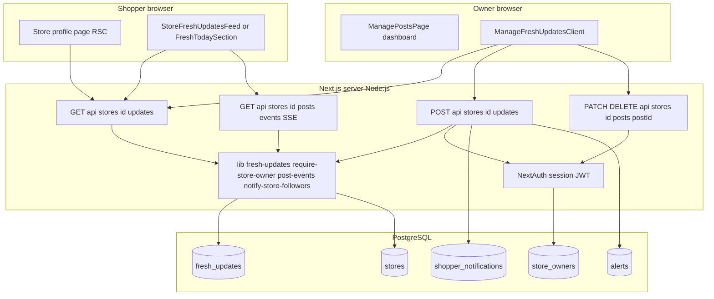
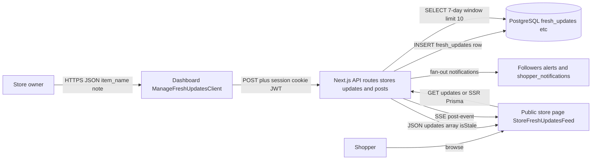
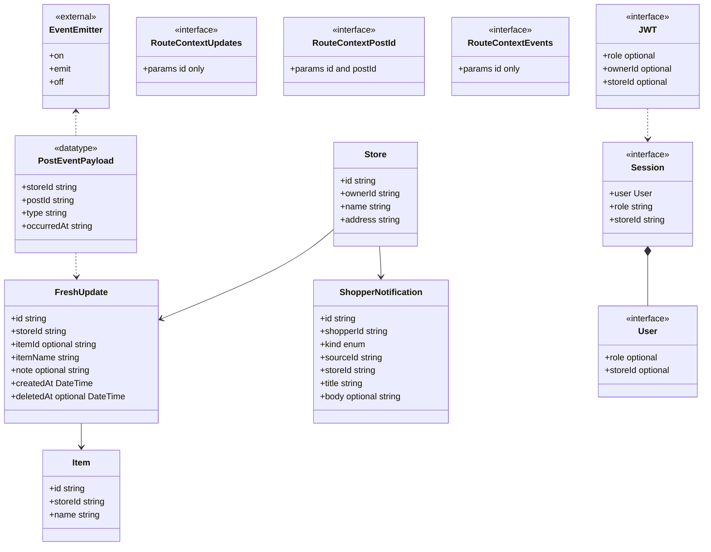

# Dev Spec: User Story 11 — Post “Fresh Today” Updates (Owner)

**GitHub issue:** [User Story 11](https://github.com/gsha22/GrocerEase/issues/13)  
**Related shopper story:** [User Story 1 — Fresh Today Updates (Shopper)](https://github.com/gsha22/GrocerEase/issues/6)

This document describes the **owner-side** implementation: posting and managing “fresh today” / “newly in stock” updates that appear on the public store profile (Story 1). It reflects the GrocerEase codebase as implemented in this repository.

---

## 1. Story ownership

| Role | Name / assignment |
|------|-------------------|
| **Primary owner** | _Gabriel_ |
| **Secondary owner** | _Andrew_ |

---

## 2. Merge date on `main`

The owner-facing “fresh updates” flow (POST `POST /api/stores/:id/updates`, dashboard UI, and related server logic) landed on `main` via:

- **Merge commit:** `229c441` — *Merge pull request #35 from `gsha22/feature/fresh_today_updates`*
- **Merged at:** **2026-03-26 01:24:07 −0400** (Eastern Time)

Earlier work introduced the public GET route and shopper display in PR #18 (*Story 1*); PR #35 extended the feature for owners posting updates and enhanced the store profile.

---

## 3. Architecture diagram (execution context)

Components run in the **shopper’s browser**, the **owner’s browser** (dashboard), a **Next.js server** (Node.js — API routes + React Server Components), and **PostgreSQL** (persistent data). In-app notifications for followers also touch the `shopper_notifications` table.

_File paths and exact route strings appear in §12; diagram labels avoid backticks and bracket segments so GitHub Mermaid parses reliably._

**Execution notes**

- **Browser:** Renders UI; runs `fetch` and `EventSource` (SSE) for live refresh on the public store page.
- **Next.js server:** Handles HTTP, validates bodies, enforces owner session for mutating routes, runs Prisma queries, broadcasts in-process events for SSE.
- **PostgreSQL:** Durable storage for updates, stores, and notification fan-out rows.

---

## 4. Information flow diagram

**Data moved**

| Data | Direction | Purpose |
|------|-----------|---------|
| `item_name`, `note` | Owner → server → DB | Persist inventory highlight |
| Session cookie (JWT) | Owner browser → server | Prove owner role and `storeId` / ownership |
| `updates[]` with `isStale` | Server → shopper/owner browsers | Render lists with staleness |
| `shopper_notifications` rows | Server → DB | Notify `store_follow` shoppers (Story 12 integration) |

---

## 5. Class diagram (TypeScript / Prisma / runtime)

The app is mostly **modules and function components**, not classical inheritance. Prisma **models** map to generated **types**; **Node’s `EventEmitter`** is used internally for SSE (composition, not subclassing in our code). The diagram includes **relational** and **conceptual** “is-a” links where the codebase extends framework types.

**Subclass / extension notes**

- **`User` / `Session` / `JWT`:** Declared in `types/next-auth.d.ts` via `declare module "next-auth"` and `declare module "next-auth/jwt"` — they **augment** the upstream NextAuth interfaces (module augmentation), which is the TypeScript idiom for “extends” here.
- **`EventEmitter`:** `lib/post-events.ts` **composes** a singleton `EventEmitter` from Node (`globalThis`); the app does **not** declare a subclass of `EventEmitter`.
- **`RouteContext*`:** Three separate `interface RouteContext` blocks in different route files (same name, different `params` shapes) — listed separately so none are omitted.

---

## 6. Relevant types / modules — members and purpose

TypeScript **does not** use Java-style `public`/`private` keywords everywhere below; **public** means exported API or props; **private** means module-local or component-closed state/handlers.

### 6.1 `app/api/stores/[id]/updates/route.ts`

| Kind | Name | Purpose |
|------|------|---------|
| **Public** | `GET(request, context)` | Public list of updates (7-day window, max 10); optional `?all=true` for owner-only full list. |
| **Public** | `POST(request, context)` | Create `FreshUpdate` for the store; requires owner session. |
| **Private** | `interface RouteContext` | `params: Promise<{ id: string }>` for dynamic segment `[id]`. |

### 6.2 `lib/fresh-updates.ts`

| Kind | Name | Purpose |
|------|------|---------|
| **Public** | `FRESH_UPDATE_PUBLIC_WINDOW_MS` | Seven-day cutoff for public lists. |
| **Public** | `FRESH_UPDATE_STALE_THRESHOLD_MS` | Forty-eight-hour staleness threshold. |
| **Public** | `FRESH_UPDATE_PUBLIC_LIST_LIMIT` | Max rows (10) for public GET. |
| **Public** | `MAX_ITEM_NAME_LEN`, `MAX_NOTE_LEN` | Validation limits (200 / 500). |
| **Public** | `parseFreshUpdatePostBody(body)` | Validates POST JSON (`item_name` required, optional `note`). |
| **Public** | `parseFreshUpdatePatchBody(body)` | Validates PATCH for posts (Story 10/13). |
| **Public** | `enrichFreshUpdatesWithStale(rows, now, threshold?)` | Adds `isStale` from `createdAt`. |
| **Public** | Types `ParsedFreshUpdatePost`, `ParsedFreshUpdatePatch` | Discriminated unions for parse results. |

### 6.3 `lib/require-store-owner.ts`

| Kind | Name | Purpose |
|------|------|---------|
| **Public** | `requireStoreOwnerForStore(storeId)` | Loads session via `auth()`, loads `Store`, checks `ownerId`; returns `{ session, store }` or `{ response }` JSON error. |

### 6.4 `lib/post-events.ts`

| Kind | Name | Purpose |
|------|------|---------|
| **Public** | `broadcastPostEvent(event)` | Emits `POST_CREATE` / `POST_UPDATE` / `POST_DELETE` on in-memory bus keyed by `storeId`. |
| **Public** | `subscribeToPostEvents(storeId, listener)` | SSE route subscribes; returns unsubscribe. |
| **Public** | `PostEventPayload`, `PostEventType` | Typed payloads for SSE (`postId` is a `FreshUpdate` id). |
| **Private** | `getPostEventBus()`, `POST_EVENTS_KEY` | Singleton `EventEmitter` on `globalThis`. |
| **Private** | `GlobalWithPostBus` | Typing for attaching bus to `globalThis`. |

### 6.5 `lib/notify-store-followers.ts`

| Kind | Name | Purpose |
|------|------|---------|
| **Public** | `notifyStoreFollowersOfFreshUpdate(params)` | Finds active `store_follow` alerts; inserts `shopper_notifications` rows; swallows errors (does not fail POST). |
| **Private** | `activeStoreFollowShopperIds`, `insertNotificationsForFollowers`, `formatPrice` | Helpers (price used by deal path). |

### 6.6 `lib/prisma.ts`

| Kind | Name | Purpose |
|------|------|---------|
| **Public** | `prisma` | Singleton `PrismaClient` with `@prisma/adapter-pg`. |

### 6.7 `app/api/stores/[id]/posts/[postId]/route.ts`

| Kind | Name | Purpose |
|------|------|---------|
| **Public** | `PATCH` | Owner edits `FreshUpdate` fields (uses `parseFreshUpdatePatchBody`). |
| **Public** | `DELETE` | Soft-delete (`deletedAt`). |
| **Private** | `interface RouteContext` | `params: Promise<{ id: string; postId: string }>`. |

### 6.8 `app/api/stores/[id]/posts/events/route.ts`

| Kind | Name | Purpose |
|------|------|---------|
| **Public** | `GET` | Server-Sent Events stream for `post-event` + keepalive. |
| **Private** | `interface RouteContext` | `params: Promise<{ id: string }>`. |
| **Private** | `toSseMessage` | Formats SSE frames. |

### 6.9 `app/(dashboard)/dashboard/posts/page.tsx` (`ManagePostsPage`)

| Kind | Name | Purpose |
|------|------|---------|
| **Public** | default export (server component) | `auth()`; redirects unauthenticated users; requires `session.storeId` before rendering `ManageFreshUpdatesClient`. |

### 6.10 `ManageFreshUpdatesClient` (`app/(dashboard)/dashboard/posts/ManageFreshUpdatesClient.tsx`)

**Type alias (public to module)**

| Name | Purpose |
|------|---------|
| `ApiFreshUpdate` | Shape of one update from GET `?all=true` (id, itemName, note, createdAt, isStale). |

**Props (public)**

| Field | Purpose |
|-------|---------|
| `storeId` | Target store for all API calls. |

**State & handlers (conceptually private to the component)**

| Field / handler | Purpose |
|-----------------|---------|
| `updates`, `loading`, `loadError` | List and loading/error for `?all=true` GET. |
| `itemName`, `note`, `error`, `success`, `submitting` | Create form. |
| `editingId`, `editItemName`, `editNote`, `savingEdit`, `deletingId` | Inline edit/delete. |
| `mountedRef`, `submitAbortRef` | Abort-safe async / unmount. |
| `load`, `onSubmit`, `beginEdit`, `cancelEdit`, `saveEdit`, `deletePost` | User actions. |

**Grouped by concept (assignment layout)**

*Public (props + exported component)*

| Concept | Members | Purpose |
|---------|---------|---------|
| Component contract | default export `ManageFreshUpdatesClient`, prop `storeId` | Entry point; identifies which store to load and post to. |

*Private (module-local state and handlers — not exported)*

| Concept | Members | Purpose |
|---------|---------|---------|
| List / server sync | `updates`, `loading`, `loadError`, `load()` | Fetch `GET ?all=true` and hold result or errors. |
| Create post | `itemName`, `note`, `error`, `success`, `submitting`, `onSubmit()` | Form for new `item_name` / `note` and POST. |
| Edit post | `editingId`, `editItemName`, `editNote`, `savingEdit`, `beginEdit()`, `cancelEdit()`, `saveEdit()` | Inline PATCH flow. |
| Delete post | `deletingId`, `deletePost()` | DELETE with confirm. |
| Lifecycle / safety | `mountedRef`, `submitAbortRef` | Avoid setState after unmount; abort in-flight POST. |

### 6.11 `lib/time.ts`

| Kind | Name | Purpose |
|------|------|---------|
| **Public** | `relativeTime(date)` | UI strings like “posted 2h ago”. |
| **Public** | `freshnessLevel(date)` | `"fresh"` / `"stale"` / `"hidden"` for shopper UI filtering. |

### 6.12 `components/FreshTodaySection.tsx` & `components/StoreFreshUpdatesFeed.tsx`

Client components: **public** default export; **private** local types `FreshUpdate` / `ApiResponse` and inner helpers (`EmptyState`, skeletons) where present.

### 6.13 Prisma schema models (generated client types)

**`FreshUpdate`** (table `fresh_updates`): fields listed in §5; `itemId` exists for optional catalog linkage but POST path sets `storeId`, `itemName`, `note` only.

**`Store`, `StoreOwner`, `Alert`, `ShopperNotification`:** used for ownership, follower alerts, and notifications.

### 6.14 `auth.ts` / `auth.config.ts` / `types/next-auth.d.ts`

**Public:** `auth`, `handlers`, `signIn`, `signOut`, `authConfig`. **Session** carries `role` and `storeId` for owners — required for dashboard and `requireStoreOwnerForStore`.

**Augmented interfaces (`types/next-auth.d.ts`)**

| Interface | Fields (relevant to Story 11) | Purpose |
|-----------|------------------------------|---------|
| `User` | `role?`, `storeId?` | Distinguish owner vs shopper; bind owner to store. |
| `Session` | `user.id`, `user.email`, `user.name`, `role`, `storeId` | Server components and API gates read `storeId` for owners. |
| `JWT` | `role?`, `ownerId?`, `shopperId?`, `storeId?` | Token claims used in `jwt` callback to populate session. |

---

## 7. External technologies (not authored by this team)

Versions are taken from `package.json` at the time of this spec unless noted.

| Technology | Version | Used for | Why this choice | Source & docs |
|------------|---------|----------|-----------------|---------------|
| **TypeScript** | `^5` (devDependency) | Static typing across app and scripts | Industry standard for large JS codebases; catches API/shape errors early | Author: Microsoft — https://www.typescriptlang.org/ — https://github.com/microsoft/TypeScript |
| **Node.js** | _(runtime; align with Vercel / local; e.g. 20 LTS)_ | Runs Next.js server, Prisma, tests | Required by Next.js 16 | OpenJS Foundation — https://nodejs.org/ — https://github.com/nodejs/node |
| **Next.js** | `^16.2.1` | App Router, API routes, RSC, bundling | Full-stack React framework with first-class API routes and deployment story | Vercel — https://nextjs.org/docs — https://github.com/vercel/next.js |
| **React** | `19.2.4` | UI components | Core UI library aligned with Next 16 | Meta — https://react.dev/ — https://github.com/facebook/react |
| **react-dom** | `19.2.4` | DOM rendering | Peer of React for web | Meta — https://react.dev/ |
| **Prisma** | `^7.5.0` | ORM, migrations, type-safe queries | Strong DB typing and migration workflow vs. raw SQL everywhere | Prisma GmbH — https://www.prisma.io/docs — https://github.com/prisma/prisma |
| **`@prisma/client`** | `^7.5.0` | Generated DB client | Same as above | https://www.prisma.io/docs/orm/prisma-client |
| **`@prisma/adapter-pg`** | `^7.5.0` | Prisma ↔ `pg` driver | Driver adapter for PostgreSQL in Prisma 7 | Prisma docs (PostgreSQL adapter) |
| **`pg`** | `^8.20.0` | PostgreSQL wire protocol | Standard Node driver for Postgres | Brian Carlson et al. — https://node-postgres.com/ — https://github.com/brianc/node-postgres |
| **PostgreSQL** | _(server version per hosting; e.g. 15+)_ | Durable relational storage | Robust OSS RDBMS; fits relational store/update model | PostgreSQL Global Development Group — https://www.postgresql.org/docs/ |
| **NextAuth.js** (`next-auth`) | `^5.0.0-beta.30` | Session/JWT, credentials login | Integrated auth for Next.js; JWT sessions for API authorization | NextAuth.js — https://authjs.dev/ — https://github.com/nextauthjs/next-auth |
| **bcryptjs** | `^3.0.3` | Password hashing (owner/shopper auth) | Well-known password hashing; pure JS option | https://github.com/dcodeIO/bcrypt.js |
| **Tailwind CSS** | `^4` (dev) | Utility-first styling | Rapid, consistent UI in repo | Tailwind Labs — https://tailwindcss.com/docs — https://github.com/tailwindlabs/tailwindcss |
| **PostCSS / `@tailwindcss/postcss`** | `^4` | CSS pipeline for Tailwind v4 | Required toolchain for Tailwind 4 | Tailwind Labs |
| **ESLint** | `^9` | Linting | Catch common bugs and style issues | OpenJS Foundation — https://eslint.org/docs/latest/ — https://github.com/eslint/eslint |
| **`eslint-config-next`** | `^16.2.1` | Next/React rules preset | Official Next.js lint integration | Vercel |
| **`tsx`** | `^4.21.0` | Run TypeScript scripts/tests | Execute `scripts/*.ts` without separate compile step | https://github.com/privatenumber/tsx |
| **`dotenv`** | `^17.3.1` | Load env in scripts | Local/script configuration | https://github.com/motdotla/dotenv |
| **Leaflet / react-leaflet** | `^1.9.4` / `^5.0.0` | Maps elsewhere in app | Not central to Story 11; present in project | https://leafletjs.com/ , https://react-leaflet.js.org/ |

---

## 8. Long-term storage: `fresh_updates` and related tables

### 8.1 `fresh_updates` (primary table for this story)

| Column / field | Type (Prisma / DB) | Purpose | Approx. storage per row |
|----------------|--------------------|---------|-------------------------|
| `id` | UUID (`String` @id) | Primary key | **16 B** (Postgres `uuid` internal) |
| `store_id` | UUID FK → `stores` | Which store posted | **16 B** |
| `item_id` | UUID nullable FK → `items` | Optional link to catalog item | **0 B** if null, else **16 B** |
| `item_name` | `String` | Required inventory headline | **1–800 B** typical (UTF-8; validated ≤200 chars × up to 4 bytes/char worst case) |
| `note` | `String?` | Optional detail | **0 B** if null; else **1–2000 B** (≤500 chars worst case) |
| `created_at` | `DateTime` | Sort order + staleness | **8 B** (`timestamptz`) |
| `deleted_at` | `DateTime?` | Soft delete (Story 10/13) | **0 B** if null; else **8 B** |

**Rough order-of-magnitude:** a typical row (short name + short note) is on the order of **~100–400 bytes** plus index overhead; indexes on `(store_id, created_at)` (if added) consume additional space proportional to row count.

### 8.2 Related storage touched by POST (not full Story 11 schema but persisted)

| Table | Purpose |
|-------|---------|
| `stores` | Read for `store.name` when building follower notifications. |
| `alerts` | Read to find `store_follow` subscribers. |
| `shopper_notifications` | Insert fan-out rows (`kind = store_fresh_update`, `sourceId = freshUpdate.id`). |

---

## 9. Failure and abuse scenarios

Effects are **user-visible** (shopper/owner) or **internal** (ops/logs). This section covers the **owner dashboard** and **public store** surfaces for this story.

| Scenario | User-visible effects | Internal / system effects |
|----------|----------------------|---------------------------|
| **Frontend process crashed** | Browser tab goes blank or freezes; owner loses unsent form text; shopper loses SPA state until reload. | Server and DB unaffected. |
| **Lost all runtime state (no crash)** | React state resets on full reload; same as refresh. | None. |
| **Erased all stored data** (browser: localStorage/cookies cleared) | Owner logged out; must sign in again; no draft recovery. | Server session invalid until re-login. |
| **DB data appears corrupt** (e.g. bad `created_at`) | Lists may sort wrong; staleness wrong; possible empty sections. | Log errors; needs manual repair or delete row. |
| **RPC / `fetch` failed** (network or 5xx) | Error toasts/messages (“Could not post update”); list may not refresh. | Log HTTP status; optional retry by user. |
| **Client overloaded (CPU)** | UI sluggish typing/submit; may feel “stuck.” | Server unaffected unless request storm. |
| **Client out of RAM** | Tab may crash (browser kills tab). | Server unaffected. |
| **Database out of space** | POST returns 5xx; owner sees failure; GET may fail. | Writes fail until disk expanded / data pruned. |
| **Lost network connectivity** | Fetches fail; SSE disconnects; user sees errors. | SSE reconnects when network returns. |
| **Lost DB access** (connection pool down) | API errors for all DB-backed routes. | Health checks / alerts should fire (ops). |
| **Bot signs up and spams users** | Not mitigated inside this story alone; depends on auth abuse controls, rate limits, CAPTCHA (if any). | Potential notification spam in `shopper_notifications`; cost and noise. |

---

## 10. PII in long-term storage (Story 11 scope)

### 10.1 Direct PII in `fresh_updates`

- **`item_name` / `note`:** These are **inventory/marketing text**, not structured personal identifiers. They could **accidentally** contain phone numbers or names if an owner types them — **policy** should discourage posting personal contact info in notes.
- **No** owner email, government ID, or shopper PII is stored in `fresh_updates`.

### 10.2 Why keep these fields

- **Business need:** Shoppers need human-readable descriptions of what is fresh or restocked.

### 10.3 How stored

- PostgreSQL rows in `fresh_updates` as UTF-8 text fields, linked by `store_id`.

### 10.4 How data enters the system

1. Owner completes dashboard form → `ManageFreshUpdatesClient` `onSubmit` → `fetch` POST `/api/stores/:id/updates` with JSON `{ item_name, note? }`.
2. `POST` handler → `requireStoreOwnerForStore` → `parseFreshUpdatePostBody` → `prisma.freshUpdate.create`.
3. Optional: `notifyStoreFollowersOfFreshUpdate` writes `shopper_notifications` with **store name** and item text in title/body.

### 10.5 After storage (read path)

- Public GET / SSR loads updates for display; notifications appear in shopper inbox for followers.

### 10.6 Responsibility for securing storage

| Unit | Suggested responsible party |
|------|-----------------------------|
| PostgreSQL cluster / credentials | _Team member(s) named as infra/DB owner — fill in._ |
| Application secrets (`DATABASE_URL`, auth secrets) | _Team member(s) with deployment access — fill in._ |

### 10.7 Auditing access to PII

- **Routine:** Application uses parameterized queries (Prisma); access only via deployed API.
- **Non-routine:** _Document your team’s process: e.g. break-glass DB read-only access, logging, two-person review for production queries._

### 10.8 Minors

- **Is minors’ PII solicited or stored for this feature?** The feature does not request age or child-specific fields. **Store content** may be family-oriented but is not structured PII of minors.
- **Guardian permission:** Not applicable to inventory posts; general app signup policies apply elsewhere.
- **Policy for minors’ PII vs. child-abuse registry:** _Fill with your course/team legal/policy stance; this repo does not implement registry checks._

---

## 11. LLM / documentation provenance

This dev spec was drafted with assistance from an **LLM in Cursor** (analysis of repository files and `git log`). For course submission, attach:

- A **URL** to this chat in Cursor (if your instructors can access it), **or**
- An **exported transcript** uploaded to a location your instructors can open.

---

## 12. References (implementation files)

- `app/api/stores/[id]/updates/route.ts`
- `app/api/stores/[id]/posts/[postId]/route.ts`
- `app/api/stores/[id]/posts/events/route.ts`
- `lib/fresh-updates.ts`, `lib/fresh-updates.test.ts`
- `lib/require-store-owner.ts`, `lib/post-events.ts`, `lib/notify-store-followers.ts`
- `app/(dashboard)/dashboard/posts/page.tsx`, `ManageFreshUpdatesClient.tsx`
- `components/FreshTodaySection.tsx`, `components/StoreFreshUpdatesFeed.tsx`
- `prisma/schema.prisma` (`FreshUpdate` model)
- `scripts/fresh-updates-machine-tests.ts`
