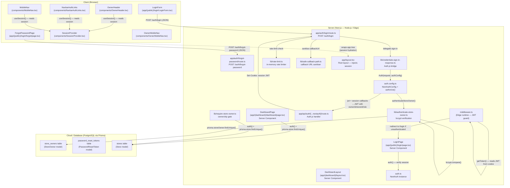
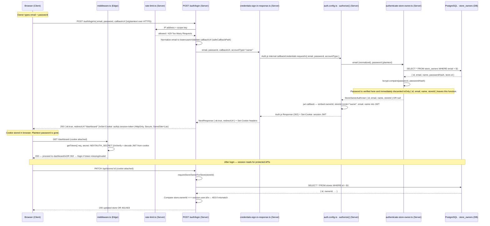

# Dev Spec — US 6: Secure Store Owner Login

> **User Story:** As a store owner, I want to log in securely to my store dashboard so that only I can manage my store's listings and posts.

---

## 1. Ownership

| Role | GitHub Handle | Name |
|---|---|---|
| **Primary Owner** | `AvalonMei` | Eric Du |
| **Secondary Owner** | `evelyn-lo` | Evelyn |

The primary owner (`AvalonMei`) authored and submitted PR #24 ([Feature/secure authentication](https://github.com/gsha22/GrocerEase/pull/24)), which contains the full implementation. The secondary owner (`evelyn-lo`) reviewed and merged the PR, and was co-assigned on the originating issue ([Issue #2](https://github.com/gsha22/GrocerEase/issues/2)).

**Date merged into `main`:** 2026-03-25 (PR #24 merged at 2026-03-25T06:15:31Z)

---

## 2. Architecture Diagram

The diagram below shows every component introduced or modified by US 6, annotated by **where it executes**: the user's browser (Client), the Next.js server process (Server), or the hosted PostgreSQL database (Cloud / DB).



---

## 3. Information Flow Diagram

The diagram below shows which **user data and application data** moves between architectural components, and in what direction, during the login flow.



### Key data items and their flows

| Data Item | Source | Direction | Destination | Notes |
|---|---|---|---|---|
| `email` (plaintext) | Browser form | → Server | `authenticate-store-owner.ts` → DB query (lookup key in `store_owners`) | Normalized to lowercase before the DB query; not echoed in server logs during login |
| `password` (plaintext) | Browser form | → Server | `authenticate-store-owner.ts` only | Compared via bcrypt; never stored or forwarded |
| `passwordHash` | `store_owners` DB | → Server | `authenticate-store-owner.ts` only | Never leaves the server; never included in API responses |
| `ownerId` | DB (`store_owners.id`) | → Server JWT | Session cookie → middleware → API routes | Embedded in JWT; used as identity key |
| `storeId` | DB (`stores.id`) | → Server JWT | Session cookie → `requireStoreOwnerForStore` | Allows fast ownership checks without extra DB queries |
| `role` (`"owner"`) | `auth.config.ts` | → JWT | Session cookie → middleware → client via `useSession` | Controls route guards and UI visibility |
| JWT session token | Server (Auth.js) | → Browser | `Set-Cookie: authjs.session-token` | HttpOnly, Secure, SameSite=Lax; signed with `NEXTAUTH_SECRET` |
| `callbackUrl` | Browser query param | → Server | Sanitized by `safeCallbackPath`; embedded in redirect response | Validated to reject open-redirect attempts |
| IP address | HTTP headers (`x-forwarded-for`) | → Server | `rate-limit.ts` in-memory store | Used as rate-limit key; never persisted |

---

## 4. Class Diagram

```mermaid
classDiagram
    %% ── TypeScript types & interfaces ──────────────────────────────

    class OwnerUser {
        <<type>>
        +id : string
        +email : string
        +name : string
        +storeId : string | null
        +role : "owner"
    }

    class ShopperUser {
        <<type>>
        +id : string
        +email : string
        +name : string
        +role : "shopper"
    }

    class StoreOwnerAuthUser {
        <<type>>
        +id : string
        +email : string
        +name : string
        +storeId : string | null
    }

    class NextAuthUser {
        <<interface>>
        +id : string
        +email : string
        +name : string
        +role : "owner" | "shopper"
        +storeId : string | null
    }

    class NextAuthSession {
        <<interface>>
        +user : object
        +role : "owner" | "shopper"
        +storeId : string | null
    }

    class NextAuthJWT {
        <<interface>>
        +role : "owner" | "shopper"
        +ownerId : string
        +shopperId : string
        +storeId : string | null
    }

    class Bucket {
        <<type>>
        +count : number
        +resetAt : number
    }

    class CredentialsAccountType {
        <<type>>
        +value : "owner" | "shopper"
    }

    %% ── Auth configuration & instance ──────────────────────────────

    class AuthConfigModule {
        <<module>>
        +authConfig : NextAuthConfig
        -authorize(credentials) : Promise~OwnerUser|ShopperUser|null~
        -jwtCallback(token, user) : Promise~JWT~
        -sessionCallback(session, token) : Promise~Session~
    }

    class AuthModule {
        <<module>>
        +handlers : NextAuth.Handlers
        +auth : Auth
        +signIn : SignIn
        +signOut : SignOut
        +authConfig : NextAuthConfig
    }

    %% ── Middleware ─────────────────────────────────────────────────

    class MiddlewareModule {
        <<module>>
        +config : object
        +middleware(req : NextRequest) : Promise~NextResponse~
        -isShopperToken(token : JWT) : boolean
    }

    %% ── Library / utility modules ──────────────────────────────────

    class AuthenticateStoreOwnerModule {
        <<module>>
        +authenticateStoreOwner(email : string, password : string) : Promise~StoreOwnerAuthUser|null~
    }

    class RequireStoreOwnerModule {
        <<module>>
        +requireStoreOwnerForStore(storeId : string) : Promise~GateResult~
    }

    class CredentialsSignInResponseModule {
        <<module>>
        +runCredentialsSignIn(req, email, password, callbackUrl, accountType, fallbackPath) : Promise~NextResponse~
        +buildCredentialsAuthRequest(req, email, password, callbackUrl, accountType) : Request
        +nextResponseFromCredentialsAuth(req, authRes, fallbackPath) : NextResponse
        +safeRedirectPathForClient(locationHeader, requestOrigin, fallbackPath) : string
    }

    class RateLimitModule {
        <<module>>
        +isAuthRateLimited(req : NextRequest, scope : string) : boolean
        -requestIp(req : NextRequest) : string
        -store : Map~string, Bucket~
    }

    class SafeCallbackPathModule {
        <<module>>
        +safeCallbackPath(raw : string|null, fallback : string) : string
        +isSafeRelativeAppPath(url : string) : boolean
    }

    %% ── Audit module ───────────────────────────────────────────────

    class AuthAuditModule {
        <<module>>
        +writeAuthAuditLog(params) : Promise~void~
        +hashForAudit(value : string) : string
    }

    class AuthAuditLog {
        <<model>>
        +id : string
        +createdAt : DateTime
        +event : string
        +outcome : string
        +accountType : string
        +emailHash : string?
        +ownerId : string?
        +ipAddress : string?
    }

    %% ── Route handlers ─────────────────────────────────────────────

    class LoginRoute {
        <<route>>
        +POST(req : NextRequest) : Promise~NextResponse~
    }

    class ForgotPasswordRoute {
        <<route>>
        +POST(req : NextRequest) : Promise~NextResponse~
    }

    class StoreRoute {
        <<route>>
        +GET(req : NextRequest, params) : Promise~NextResponse~
        +PATCH(req : NextRequest, params) : Promise~NextResponse~
    }

    %% ── React components (Server) ──────────────────────────────────

    class RootLayout {
        <<component>>
        +children : ReactNode
        +render() : JSX.Element
    }

    class LoginPage {
        <<component>>
        +render() : JSX.Element
    }

    class DashboardLayout {
        <<component>>
        +children : ReactNode
        +render() : JSX.Element
    }

    class DashboardPage {
        <<component>>
        +render() : JSX.Element
    }

    class Navbar {
        <<component>>
        +render() : JSX.Element
    }

    class MobileNav {
        <<component>>
        +render() : JSX.Element
    }

    %% ── React components (Client) ──────────────────────────────────

    class LoginForm {
        <<component>>
        -email : string
        -password : string
        -error : string | null
        -pending : boolean
        -callbackUrl : string
        +onSubmit(e : FormEvent) : Promise~void~
        +render() : JSX.Element
    }

    class ForgotPasswordPage {
        <<component>>
        -email : string
        -notImplemented : string | null
        -error : string | null
        -pending : boolean
        +onSubmit(e : FormEvent) : Promise~void~
        +render() : JSX.Element
    }

    class SessionProvider {
        <<component>>
        +session : Session | null
        +children : ReactNode
        +render() : JSX.Element
    }

    class OwnerHeader {
        <<component>>
        -email : string
        +render() : JSX.Element
    }

    class OwnerMobileNav {
        <<component>>
        -pathname : string
        +render() : JSX.Element
    }

    class Sidebar {
        <<component>>
        -pathname : string
        +render() : JSX.Element
    }

    %% ── Prisma models ──────────────────────────────────────────────

    class StoreOwner {
        <<model>>
        +id : string
        +email : string
        +passwordHash : string
        +name : string
        +sessionToken : string?
        +createdAt : DateTime
        +store : Store?
        +passwordResetTokens : PasswordResetToken[]
    }

    class PasswordResetToken {
        <<model>>
        +id : string
        +tokenHash : string
        +ownerId : string
        +expiresAt : DateTime
        +createdAt : DateTime
        +owner : StoreOwner
    }

    class Store {
        <<model>>
        +id : string
        +ownerId : string
        +name : string
        +address : string
        +lat : float?
        +lng : float?
        +hours : Json?
        +categories : string[]
        +isPublished : boolean
        +createdAt : DateTime
    }

    %% ── Type hierarchy (module augmentation) ──────────────────────
    NextAuthUser <|-- OwnerUser : extends
    NextAuthUser <|-- ShopperUser : extends
    NextAuthSession <|-- NextAuthJWT : extends (JWT is session token)

    %% ── Auth wiring ───────────────────────────────────────────────
    AuthModule ..> AuthConfigModule : uses
    AuthConfigModule ..> OwnerUser : produces
    AuthConfigModule ..> ShopperUser : produces
    AuthConfigModule ..> NextAuthJWT : populates
    AuthConfigModule ..> NextAuthSession : populates
    AuthConfigModule ..> AuthenticateStoreOwnerModule : calls

    %% ── Middleware ────────────────────────────────────────────────
    MiddlewareModule ..> NextAuthJWT : reads from cookie
    MiddlewareModule ..> AuthModule : uses getToken

    %% ── Audit wiring ──────────────────────────────────────────────
    AuthAuditModule ..> AuthAuditLog : writes to DB
    LoginRoute ..> AuthAuditModule : logs every attempt

    %% ── Login route wiring ────────────────────────────────────────
    LoginRoute ..> RateLimitModule : checks
    LoginRoute ..> SafeCallbackPathModule : sanitises with
    LoginRoute ..> CredentialsSignInResponseModule : delegates to
    CredentialsSignInResponseModule ..> AuthConfigModule : calls Auth()
    CredentialsSignInResponseModule ..> CredentialsAccountType : uses

    %% ── Auth lib wiring ───────────────────────────────────────────
    AuthenticateStoreOwnerModule ..> StoreOwnerAuthUser : returns
    AuthenticateStoreOwnerModule ..> StoreOwner : queries
    RequireStoreOwnerModule ..> AuthModule : calls auth()
    RequireStoreOwnerModule ..> Store : queries

    %% ── Store route ────────────────────────────────────────────────
    StoreRoute ..> RequireStoreOwnerModule : guards with

    %% ── Rate limiter internals ────────────────────────────────────
    RateLimitModule ..> Bucket : stores in Map

    %% ── Page / layout composition ─────────────────────────────────
    RootLayout *-- SessionProvider : renders
    RootLayout ..> AuthModule : calls auth()
    LoginPage *-- LoginForm : renders
    LoginPage ..> AuthModule : calls auth()
    DashboardLayout *-- OwnerHeader : renders
    DashboardLayout *-- Sidebar : renders
    DashboardLayout *-- OwnerMobileNav : renders
    DashboardPage ..> AuthModule : calls auth()
    DashboardPage ..> Store : queries via prisma
    Navbar ..> AuthModule : calls auth()
    MobileNav ..> AuthModule : calls auth()
    OwnerHeader ..> NextAuthSession : reads via useSession()

    %% ── DB relationships ──────────────────────────────────────────
    StoreOwner "1" --> "0..1" Store : owns
    StoreOwner "1" --> "0..*" PasswordResetToken : has
    PasswordResetToken "0..*" --> "1" StoreOwner : belongs to
```

All classes, types, interfaces, and modules relevant to US 6 are shown below. Prisma models are marked `<<model>>`, React components `<<component>>`, utility modules `<<module>>`, route handlers `<<route>>`, and TypeScript types/interfaces `<<type>>` or `<<interface>>`.



---

## 5. Class List

Classes are listed in the order: route handlers → auth config/instance → middleware → library modules → React server components → React client components → Prisma models → TypeScript types/interfaces. Within each class, public fields and methods are listed first (grouped by concept), then private.

---

### `LoginRoute` — `app/auth/login/route.ts`

Custom Next.js API route. Accepts owner login credentials as JSON and returns a session cookie.

**Public methods**

| Method | Description |
|---|---|
| `POST(req: NextRequest): Promise<NextResponse>` | Entry point for `POST /auth/login`. Checks the rate limit, validates that email and password are non-empty, normalises email to lowercase, sanitises `callbackUrl`, and delegates to `runCredentialsSignIn`. Returns `{ ok, redirectUrl }` + `Set-Cookie` on success, or a JSON error object with status 400, 401, or 429. |

---

### `ForgotPasswordRoute` — `app/auth/forgot-password/route.ts`

Stable stub for the password-reset flow. Returns 501 so the UI can display a friendly "not yet implemented" message.

**Public methods**

| Method | Description |
|---|---|
| `POST(req: NextRequest): Promise<NextResponse>` | Accepts `{ email }`. Validates that email is present. Always returns `{ error, code: "NOT_IMPLEMENTED" }` with HTTP 501. |

---

### `StoreRoute` — `app/api/stores/[id]/route.ts`

REST handler for individual store resources. The `PATCH` method is gated by ownership for US 6.

**Public methods**

| Method | Description |
|---|---|
| `GET(req, { params }): Promise<NextResponse>` | Returns the published store record for the given `id`. No authentication required. |
| `PATCH(req, { params }): Promise<NextResponse>` | Updates the store profile. Calls `requireStoreOwnerForStore` to verify the caller owns the store before applying changes. Returns 401 if unauthenticated, 403 if the caller owns a different store. |

---

### `AuthConfigModule` — `auth.config.ts`

Defines the Auth.js configuration: credentials provider, JWT session strategy, custom pages, and `jwt`/`session` callbacks that stamp `ownerId`, `storeId`, and `role` onto every token and session.

**Public fields**

| Field | Description |
|---|---|
| `authConfig: NextAuthConfig` | Exported config object passed to `NextAuth()` and used directly by `CredentialsSignInResponseModule` via `Auth()`. |

**Private methods**

| Method | Description |
|---|---|
| `authorize(credentials): Promise<OwnerUser \| ShopperUser \| null>` | Credentials provider callback. Reads `accountType` to route to `authenticateStoreOwner` or `authenticateShopper`. Returns a typed user object or `null` on failure. |
| `jwtCallback({ token, user }): Promise<JWT>` | Auth.js `jwt` callback. On first sign-in, stamps `ownerId`/`shopperId`, `storeId`, and `role` onto the token. |
| `sessionCallback({ session, token }): Promise<Session>` | Auth.js `session` callback. Copies `role` and `storeId` from the JWT into the session object surfaced to the app. |

---

### `AuthModule` — `auth.ts`

Thin wrapper that instantiates Auth.js with `authConfig` and re-exports all Auth.js primitives.

**Public fields / methods**

| Export | Description |
|---|---|
| `handlers` | Next.js route handlers for `GET /api/auth/*` and `POST /api/auth/*`. |
| `auth` | Server-side function to read the current session (used in Server Components and route handlers). |
| `signIn` | Server-side function to programmatically sign in. |
| `signOut` | Server-side function to programmatically sign out. |
| `authConfig` | Re-exported config, used by `CredentialsSignInResponseModule`. |

---

### `MiddlewareModule` — `middleware.ts`

Next.js Edge middleware. Runs on every request matching `/dashboard/*` or `/shopper/account/*` and enforces authentication and role-based access before the request reaches any page or route handler.

**Public fields / methods**

| Field / Method | Description |
|---|---|
| `config: { matcher: string[] }` | Declares which URL patterns trigger the middleware. |
| `middleware(req: NextRequest): Promise<NextResponse>` | Reads the JWT from the incoming cookie via `getToken`. Redirects to `/login` if no token is present on a `/dashboard` path; redirects shoppers away from owner-only paths and vice versa. |

**Private methods**

| Method | Description |
|---|---|
| `isShopperToken(token): boolean` | Returns `true` if the JWT contains `role === "shopper"` or a `shopperId` field, distinguishing shoppers from store owners. |

---

### `AuthenticateStoreOwnerModule` — `lib/authenticate-store-owner.ts`

Single-purpose library function shared by `auth.config.ts` and the machine test scripts.

**Public methods**

| Method | Description |
|---|---|
| `authenticateStoreOwner(email, password): Promise<StoreOwnerAuthUser \| null>` | Normalises email, queries `store_owners` by email via Prisma, and runs `bcrypt.compare` against the stored hash. Returns a safe user object (no hash) on success, or `null` on failure. |

---

### `RequireStoreOwnerModule` — `lib/require-store-owner.ts`

Authorization guard reused by every owner-scoped API route.

**Public methods**

| Method | Description |
|---|---|
| `requireStoreOwnerForStore(storeId: string): Promise<GateResult>` | Calls `auth()` to get the session. Returns `{ response: 401 }` if no session, `{ response: 404 }` if the store doesn't exist, `{ response: 403 }` if `store.ownerId !== session.user.id`, or `{ session, store }` if the caller is the verified owner. |

---

### `CredentialsSignInResponseModule` — `lib/credentials-sign-in-response.ts`

Bridges the custom `POST /auth/login` JSON API with Auth.js's internal credentials callback, extracting session cookies from the Auth.js response and forwarding them to the browser.

**Public methods**

| Method | Description |
|---|---|
| `runCredentialsSignIn(req, email, password, callbackUrl, accountType, fallbackPath): Promise<NextResponse>` | Orchestrates `buildCredentialsAuthRequest` + `Auth()` + `nextResponseFromCredentialsAuth`. Top-level function called by `LoginRoute`. |
| `buildCredentialsAuthRequest(req, email, password, callbackUrl, accountType): Request` | Constructs an internal `POST /api/auth/callback/credentials` request that Auth.js can process, embedding credentials and `callbackUrl`. |
| `nextResponseFromCredentialsAuth(req, authRes, fallbackPath): NextResponse` | Interprets Auth.js's redirect response: extracts `Set-Cookie` headers, converts the internal redirect into a JSON `{ ok, redirectUrl }` payload, or returns 401 if Auth.js signals a credentials error. |
| `safeRedirectPathForClient(locationHeader, requestOrigin, fallbackPath): string` | Converts an Auth.js `Location` header into a same-origin relative path safe for `router.push`. Rejects cross-origin URLs and protocol-relative paths. |

---

### `RateLimitModule` — `lib/rate-limit.ts`

In-process sliding-window rate limiter. Stored on `globalThis` so it survives Next.js hot-reload in development.

**Public methods**

| Method | Description |
|---|---|
| `isAuthRateLimited(req: NextRequest, scope: string): boolean` | Returns `true` if the IP + scope key has exceeded 20 requests in the last 60 seconds. Increments the counter otherwise. |

**Private fields / methods**

| Field / Method | Description |
|---|---|
| `store: Map<string, Bucket>` | In-memory map from `"scope:ip"` key to a `Bucket`. Stored on `globalThis` to persist across module reloads. |
| `requestIp(req: NextRequest): string` | Extracts the client IP from `x-forwarded-for` or `x-real-ip` headers. Returns `"unknown"` if neither is present. |

---

### `SafeCallbackPathModule` — `lib/safe-callback-path.ts`

Prevents open-redirect attacks by validating that post-login `callbackUrl` values are relative in-app paths.

**Public methods**

| Method | Description |
|---|---|
| `safeCallbackPath(raw, fallback): string` | Returns `raw` if it passes `isSafeRelativeAppPath`; otherwise returns `fallback` (default: `"/dashboard"`). |
| `isSafeRelativeAppPath(url: string): boolean` | Returns `true` only if the URL starts with `/` but not `//` (rejects protocol-relative cross-origin URLs). |

---

### `AuthAuditModule` — `lib/auth-audit.ts`

Writes structured security events to the `auth_audit_logs` table. Designed to be fire-and-forget — failures are silently swallowed so they never interrupt the login flow.

**Public methods**

| Method | Description |
|---|---|
| `writeAuthAuditLog({ event, outcome, accountType, email?, ownerId?, ipAddress? }): Promise<void>` | Creates one `auth_audit_logs` row. Hashes the email via `hashForAudit` before writing. Catches and suppresses any Prisma exception so audit failures cannot break authentication. |
| `hashForAudit(value: string): string` | Returns the lowercase-normalized SHA-256 hex digest of `value`. Used to store a correlation key for the email without persisting plaintext PII in the audit table. |

---

### `RootLayout` — `app/layout.tsx`

Root Next.js server component. Calls `auth()` at render time and injects the session into `SessionProvider` so client components can access it without an extra fetch.

**Public fields / methods**

| Field / Method | Description |
|---|---|
| `children: ReactNode` | Prop — the page or layout subtree to render. |
| `render(): JSX.Element` | Calls `auth()`, wraps `children` in `SessionProvider`, and renders the HTML shell with font variables. |

---

### `LoginPage` — `app/(public)/login/page.tsx`

Next.js Server Component that guards the login route: if the user is already authenticated it redirects them to `/dashboard` (owner) or `/shopper/account` (shopper).

**Public methods**

| Method | Description |
|---|---|
| `render(): JSX.Element` | Calls `auth()`. Redirects authenticated users. Renders the login card with `LoginForm` inside a `Suspense` boundary. |

---

### `DashboardLayout` — `app/(dashboard)/layout.tsx`

Server Component layout applied to all `/dashboard/*` routes. Composes the owner portal shell.

**Public fields / methods**

| Field / Method | Description |
|---|---|
| `children: ReactNode` | Prop — the current dashboard page. |
| `render(): JSX.Element` | Renders `OwnerHeader`, `Sidebar`, the `<main>` slot for `children`, `Footer`, and `OwnerMobileNav`. |

---

### `DashboardPage` — `app/(dashboard)/dashboard/page.tsx`

Server Component for the dashboard home. Reads the session to find the owner's store and displays it.

**Public methods**

| Method | Description |
|---|---|
| `render(): JSX.Element` | Calls `auth()` to get `ownerId`, queries Prisma for the store name and address, renders stat cards and a "recent updates" placeholder. |

---

### `Navbar` — `components/Navbar.tsx`

Server Component public site navigation bar. Renders different actions depending on authentication state and role.

**Public methods**

| Method | Description |
|---|---|
| `render(): JSX.Element` | Calls `auth()`. Shows "Owner portal" link for authenticated owners, "Sign out" when authenticated, and login/signup links for guests. |

---

### `MobileNav` — `components/MobileNav.tsx`

Server Component wrapper that resolves `auth()` and passes the derived `accountKind` to `MobileNavClient`.

**Public methods**

| Method | Description |
|---|---|
| `render(): JSX.Element` | Calls `auth()`, derives `"owner" \| "shopper" \| "guest"` from the session, passes it to `MobileNavClient`. |

---

### `LoginForm` — `app/(public)/login/LoginForm.tsx`

Client Component. Owns all mutable login-form state and submits credentials to `POST /auth/login`.

**Public methods**

| Method | Description |
|---|---|
| `onSubmit(e: FormEvent): Promise<void>` | Submits `{ email, password, callbackUrl }` as JSON to `/auth/login`, handles error display, and calls `router.push(redirectUrl)` on success. |
| `render(): JSX.Element` | Renders the email input, password input, "Forgot password?" link, error banner, and submit button. |

**Private fields**

| Field | Description |
|---|---|
| `email: string` | Controlled state for the email input. |
| `password: string` | Controlled state for the password input. |
| `error: string \| null` | Stores a server-returned error message to display in the alert banner. |
| `pending: boolean` | Disables the submit button and shows "Signing in…" while the request is in flight. |
| `callbackUrl: string` | Sanitised post-login redirect target, read from `?callbackUrl=` query param. |

---

### `ForgotPasswordPage` — `app/(public)/login/forgot/page.tsx`

Client Component for the forgot-password form. Displays the 501 stub response from the server as a non-error informational message.

**Public methods**

| Method | Description |
|---|---|
| `onSubmit(e: FormEvent): Promise<void>` | POSTs `{ email }` to `/auth/forgot-password`. Sets `notImplemented` message on 501 or `error` on other non-OK responses. |
| `render(): JSX.Element` | Renders the email input, status/error banners, and submit button. |

**Private fields**

| Field | Description |
|---|---|
| `email: string` | Controlled state for the email input. |
| `notImplemented: string \| null` | Message shown when the server returns 501. |
| `error: string \| null` | Message shown on unexpected errors. |
| `pending: boolean` | Tracks in-flight request state. |

---

### `SessionProvider` — `components/SessionProvider.tsx`

Client Component wrapper around NextAuth's `SessionProvider`. Seeds the client session cache from the server-rendered session, eliminating an extra `/api/auth/session` fetch on page load.

**Public fields / methods**

| Field / Method | Description |
|---|---|
| `session: Session \| null` | Prop — server-resolved session object passed from `RootLayout`. |
| `children: ReactNode` | Prop — the component subtree that can use `useSession()`. |
| `render(): JSX.Element` | Renders `<NextAuthSessionProvider session={session} basePath="/api/auth">`. |

---

### `OwnerHeader` — `components/OwnerHeader.tsx`

Client Component sticky header for all dashboard pages. Reads the session client-side to display the owner's email and provides a sign-out button.

**Public methods**

| Method | Description |
|---|---|
| `render(): JSX.Element` | Renders the brand link, public-site navigation links, owner email (truncated), "View site" link, and "Sign out" button. |

**Private fields**

| Field | Description |
|---|---|
| `email: string` | Owner email read from `useSession().data.user.email`. Used only for display. |

---

### `OwnerMobileNav` — `components/OwnerMobileNav.tsx`

Client Component bottom navigation bar for owner portal on small screens.

**Public methods**

| Method | Description |
|---|---|
| `render(): JSX.Element` | Renders a fixed-bottom row of icon links (Dashboard, Store, Updates, Deals, Site). Highlights the active link using `usePathname()`. |

**Private fields**

| Field | Description |
|---|---|
| `pathname: string` | Current URL path from `usePathname()`, used to compute active state per link. |

---

### `Sidebar` — `components/Sidebar.tsx`

Client Component sidebar navigation visible on large screens within the owner dashboard.

**Public methods**

| Method | Description |
|---|---|
| `render(): JSX.Element` | Renders a sticky vertical nav with links to Dashboard, Store Profile, Fresh Updates, and Deals. Highlights the active route. |

**Private fields**

| Field | Description |
|---|---|
| `pathname: string` | Current URL path from `usePathname()`, used to compute active state per link. |

---

### `StoreOwner` — Prisma model (`store_owners` table)

Represents a store owner account. The primary principal for US 6 authentication.

**Public fields**

| Field | Description |
|---|---|
| `id: string` | UUID primary key. Used as `ownerId` in the JWT session. |
| `email: string` | Unique login identifier. Stored lowercase. |
| `passwordHash: string` | bcrypt hash of the owner's password. Never exposed via API. |
| `name: string` | Display name shown in the dashboard. |
| `sessionToken: string?` | Reserved field — currently unused by Auth.js JWT strategy. |
| `createdAt: DateTime` | Account creation timestamp. |
| `store: Store?` | Associated store (one-to-one). May be `null` if the owner hasn't created a profile yet. |
| `passwordResetTokens: PasswordResetToken[]` | Future reset tokens (schema reserved). |

---

### `PasswordResetToken` — Prisma model (`password_reset_tokens` table)

Stores hashed single-use tokens for the future password reset flow. Schema migration added in this PR; no active code path yet.

**Public fields**

| Field | Description |
|---|---|
| `id: string` | UUID primary key. |
| `tokenHash: string` | bcrypt/hash of the raw reset token. Raw token is never persisted. |
| `ownerId: string` | Foreign key to `store_owners.id` (cascade delete). |
| `expiresAt: DateTime` | Expiry time for the token. |
| `createdAt: DateTime` | Token creation timestamp. |
| `owner: StoreOwner` | Relation back to the owning account. |

---

### `AuthAuditLog` — Prisma model (`auth_audit_logs` table)

Append-only security audit record. One row per login attempt. Written by `AuthAuditModule`.

**Public fields**

| Field | Description |
|---|---|
| `id: string` | UUID primary key. |
| `createdAt: DateTime` | Timestamp of the login attempt. Indexed for chronological queries. |
| `event: string` | Event type label. Currently always `"login_attempt"`. |
| `outcome: string` | Result of the attempt: `"success"`, `"invalid_credentials"`, `"rate_limited"`, or `"error"`. |
| `accountType: string` | Account kind. `"owner"` for all US 6 login events. |
| `emailHash: string?` | SHA-256 hex digest of the normalized email. `null` if email was not present in the request. Allows querying whether a specific address was targeted without exposing plaintext email in the audit log. |
| `ownerId: string?` | Foreign key to `store_owners.id`. Set only on successful logins; `null` on failures since the owner cannot be confirmed. |
| `ipAddress: string?` | Plaintext client IP address. Retained for brute-force detection and breach investigation. |

---

### `Store` — Prisma model (`stores` table)

Represents a store profile. Relevant to US 6 because `ownerId` is the foreign key used to verify store ownership in `requireStoreOwnerForStore`.

**Public fields**

| Field | Description |
|---|---|
| `id: string` | UUID primary key. Embedded in the session JWT as `storeId`. |
| `ownerId: string` | Unique foreign key to `store_owners.id`. The ownership check in `requireStoreOwnerForStore` compares this against `session.user.id`. |
| `name: string` | Store display name loaded by `DashboardPage`. |
| `address: string` | Street address. |
| `lat: float?` | Geocoded latitude. |
| `lng: float?` | Geocoded longitude. |
| `hours: Json?` | Opening hours as a JSON blob. |
| `categories: string[]` | Specialty categories. |
| `isPublished: boolean` | Whether the store is visible to shoppers. |
| `createdAt: DateTime` | Profile creation timestamp. |

---

### `OwnerUser` — type in `auth.config.ts`

Returned by `authorize()` when the account type is `"owner"`. Extends the base `NextAuthUser` interface.

| Field | Description |
|---|---|
| `id: string` | Maps to `StoreOwner.id`. |
| `email: string` | Normalised owner email. |
| `name: string` | Owner display name. |
| `storeId: string \| null` | Associated store ID, or `null` if no store yet. |
| `role: "owner"` | Discriminant literal. |

---

### `ShopperUser` — type in `auth.config.ts`

Returned by `authorize()` when `accountType === "shopper"`. Extends the base `NextAuthUser` interface.

| Field | Description |
|---|---|
| `id: string` | Maps to `Shopper.id`. |
| `email: string` | Shopper email. |
| `name: string` | Shopper display name. |
| `role: "shopper"` | Discriminant literal. |

---

### `StoreOwnerAuthUser` — type in `lib/authenticate-store-owner.ts`

Safe return type of `authenticateStoreOwner`. Contains only non-sensitive fields (no `passwordHash`).

| Field | Description |
|---|---|
| `id: string` | `StoreOwner.id` — used as `ownerId` in the JWT. |
| `email: string` | Owner email. |
| `name: string` | Owner display name. |
| `storeId: string \| null` | ID of the owner's associated store, if any. |

---

### `NextAuthUser` — module augmentation in `types/next-auth.d.ts`

Extends Auth.js's built-in `User` interface to add application-specific fields.

| Field | Description |
|---|---|
| `role?: "owner" \| "shopper"` | Account type. Used by `jwtCallback` to branch token population. |
| `storeId?: string \| null` | Store ID carried from `OwnerUser` into the JWT. |

---

### `NextAuthSession` — module augmentation in `types/next-auth.d.ts`

Extends Auth.js's built-in `Session` interface.

| Field | Description |
|---|---|
| `user: { id, email, name }` | Authenticated user info (id is `ownerId` for owners). |
| `role: "owner" \| "shopper"` | Account role, used by `middleware` and `requireStoreOwnerForStore`. |
| `storeId: string \| null` | Associated store ID, available to Server Components without a DB query. |

---

### `NextAuthJWT` — module augmentation in `types/next-auth.d.ts`

Extends Auth.js's built-in `JWT` interface with application claims.

| Field | Description |
|---|---|
| `role?: "owner" \| "shopper"` | Account role stored in the signed JWT. |
| `ownerId?: string` | Store owner's DB ID. |
| `shopperId?: string` | Shopper's DB ID. |
| `storeId?: string \| null` | Owner's store ID. |

---

### `Bucket` — type in `lib/rate-limit.ts`

Internal data structure for the in-memory rate limiter.

| Field | Description |
|---|---|
| `count: number` | Number of requests made in the current window. |
| `resetAt: number` | Unix timestamp (ms) when the window resets. |

---

### `CredentialsAccountType` — type alias in `lib/credentials-sign-in-response.ts`

Discriminant union passed to `buildCredentialsAuthRequest` to select the correct `authorize` branch in `auth.config.ts`.

| Value | Description |
|---|---|
| `"owner"` | Triggers `authenticateStoreOwner`. |
| `"shopper"` | Triggers `authenticateShopper`. |

---

## 6. Technologies, Libraries, and APIs

Only technologies directly involved in the US 6 login flow are listed below.

---

### TypeScript
- **Used for:** Primary implementation language for all source files.
- **Why chosen:** Provides static type safety across auth callbacks, JWT types, and Prisma model access, reducing runtime auth bugs. Tight integration with Next.js and Prisma's code-generated types.
- **Required version:** `^5` (devDependency)
- **Author:** Microsoft
- **Docs:** https://www.typescriptlang.org/docs/

---

### Node.js
- **Used for:** Server-side JavaScript runtime for Next.js server components, route handlers, and lib modules.
- **Why chosen:** Required runtime for Next.js; well-supported on Vercel.
- **Required version:** `^20` (from `@types/node`)
- **Author:** OpenJS Foundation
- **Docs:** https://nodejs.org/en/docs

---

### Next.js
- **Used for:** Full-stack React framework providing SSR server components, API route handlers (`app/auth/login/route.ts`, etc.), Edge middleware (`middleware.ts`), and `next/font` for typography.
- **Why chosen:** Integrates routing, SSR, API routes, and Edge middleware in a single framework, removing the need for a separate Express server. Vercel-native deployment support.
- **Required version:** `^16.2.1`
- **Author:** Vercel
- **Docs:** https://nextjs.org/docs

---

### React
- **Used for:** Component model for all UI (server and client components). `useState`, `useRouter`, `useSearchParams` used in `LoginForm` and `ForgotPasswordPage`.
- **Why chosen:** Required by Next.js App Router; industry standard with the largest ecosystem.
- **Required version:** `19.2.4`
- **Author:** Meta (Facebook)
- **Docs:** https://react.dev/

---

### React DOM
- **Used for:** DOM reconciler that renders React trees in the browser.
- **Why chosen:** Bundled with React; required for client-side rendering.
- **Required version:** `19.2.4`
- **Author:** Meta (Facebook)
- **Docs:** https://react.dev/reference/react-dom

---

### next-auth (Auth.js v5)
- **Used for:** Credentials-based authentication: JWT session creation, `authorize()` callback, `jwt`/`session` callbacks, `GET /api/auth/*` and `POST /api/auth/*` handlers, `getToken()` for Edge middleware, and `SessionProvider` for client-side session hydration.
- **Why chosen:** Purpose-built for Next.js. Handles secure cookie signing, CSRF protection, and JWT session management out of the box. Avoids reimplementing the entire auth plumbing. Compared to Passport.js, it requires no separate Express-style middleware wiring.
- **Required version:** `^5.0.0-beta.30`
- **Author:** Balázs Orbán, Auth.js contributors
- **Docs:** https://authjs.dev/

---

### bcryptjs
- **Used for:** Password hash verification in `authenticateStoreOwner` (`bcrypt.compare(password, owner.passwordHash)`). Password hashing at account creation time (outside US 6 scope).
- **Why chosen:** Pure JavaScript implementation — no native binary bindings required, so it runs reliably on any platform (including Vercel's serverless functions) without compilation. Chosen over `bcrypt` (native) for portability.
- **Required version:** `^3.0.3`
- **Author:** Daniel Wirtz (dchest)
- **Docs:** https://github.com/dcodeIO/bcrypt.js

---

### Prisma ORM
- **Used for:** Schema definition (`prisma/schema.prisma`) and database migrations (`prisma migrate`). Generates the type-safe `PrismaClient`.
- **Why chosen:** Schema-first approach generates full TypeScript types for all models, making DB access type-safe at compile time. Compared to Drizzle or Sequelize, Prisma offers better DX with auto-generated migrations and a cleaner query API.
- **Required version:** `^7.5.0`
- **Author:** Prisma Data, Inc.
- **Docs:** https://www.prisma.io/docs

---

### @prisma/client
- **Used for:** Generated database client (`prisma.storeOwner.findUnique`, `prisma.store.findUnique`) used by `authenticate-store-owner.ts`, `require-store-owner.ts`, and `DashboardPage`.
- **Why chosen:** Auto-generated from the Prisma schema; provides type-safe query results with zero manual type definitions.
- **Required version:** `^7.5.0`
- **Author:** Prisma Data, Inc.
- **Docs:** https://www.prisma.io/docs/reference/api-reference/prisma-client-reference

---

### @prisma/adapter-pg
- **Used for:** Connects Prisma Client to the PostgreSQL database via the `pg` driver.
- **Why chosen:** Required by Prisma 7 when using `pg` as the underlying driver (replaces the old built-in connector).
- **Required version:** `^7.5.0`
- **Author:** Prisma Data, Inc.
- **Docs:** https://www.prisma.io/docs/guides/database/postgresql

---

### pg (node-postgres)
- **Used for:** Low-level PostgreSQL driver that `@prisma/adapter-pg` wraps.
- **Why chosen:** The standard Node.js PostgreSQL driver; required by `@prisma/adapter-pg`.
- **Required version:** `^8.20.0`
- **Author:** Brian Carlson
- **Docs:** https://node-postgres.com/

---

### PostgreSQL
- **Used for:** Relational database that persists `store_owners`, `password_reset_tokens`, and `stores` tables.
- **Why chosen:** Robustly supports UUID primary keys, JSON columns (`hours`), and `UNIQUE` constraints needed for the auth schema. First-class support on Vercel Postgres.
- **Required version:** Compatible with Prisma 7 / `pg` 8 (Vercel-managed; version not pinned in `package.json`)
- **Author:** PostgreSQL Global Development Group
- **Docs:** https://www.postgresql.org/docs/

---

### Tailwind CSS
- **Used for:** Utility-first CSS for all login/dashboard UI: form inputs, error banners, layout, typography, and colour theming.
- **Why chosen:** Enables rapid UI iteration without writing custom CSS. Chosen over CSS Modules for consistency with the rest of the project.
- **Required version:** `^4` (devDependency)
- **Author:** Tailwind Labs
- **Docs:** https://tailwindcss.com/docs

---

### @tailwindcss/postcss
- **Used for:** PostCSS plugin that compiles Tailwind CSS v4 directives at build time.
- **Why chosen:** Required by Tailwind CSS v4 (replaces the v3 standalone CLI).
- **Required version:** `^4` (devDependency)
- **Author:** Tailwind Labs
- **Docs:** https://tailwindcss.com/docs/installation/using-postcss

---

### tsx
- **Used for:** Executes TypeScript files directly for the `npm run test:auth` machine test script (`scripts/auth-machine-tests.ts`) without a compile step.
- **Why chosen:** Zero-config TypeScript execution; lighter than `ts-node` for one-off scripts.
- **Required version:** `^4.21.0` (devDependency)
- **Author:** Hiroki Osame (privatenumber)
- **Docs:** https://tsx.is/

---

### dotenv
- **Used for:** Loads `.env` environment variables (e.g., `DATABASE_URL`, `NEXTAUTH_SECRET`) for the machine test scripts run outside of Next.js.
- **Why chosen:** Standard `.env` loader; no configuration needed.
- **Required version:** `^17.3.1` (devDependency)
- **Author:** Scott Motte, dotenv contributors
- **Docs:** https://github.com/motdotla/dotenv

---

### ESLint
- **Used for:** Static analysis and linting of TypeScript/React source files during development and CI.
- **Why chosen:** Industry-standard linter for JavaScript/TypeScript; included by default in Next.js projects.
- **Required version:** `^9` (devDependency)
- **Author:** ESLint contributors
- **Docs:** https://eslint.org/docs/latest/

---

### eslint-config-next
- **Used for:** ESLint rule set tuned for Next.js projects (React Hooks rules, `next/image`, `next/link` best-practice rules).
- **Why chosen:** Official Next.js ESLint preset; catches Next.js-specific anti-patterns automatically.
- **Required version:** `^16.2.1` (devDependency)
- **Author:** Vercel
- **Docs:** https://nextjs.org/docs/app/api-reference/config/eslint

---

### @types/bcryptjs
- **Used for:** TypeScript type declarations for `bcryptjs` (not shipped with the package itself).
- **Why chosen:** Required for type-safe usage of `bcrypt.compare()` in `authenticate-store-owner.ts`.
- **Required version:** `^2.4.6` (devDependency)
- **Author:** DefinitelyTyped contributors
- **Docs:** https://github.com/DefinitelyTyped/DefinitelyTyped/tree/master/types/bcryptjs

---

### @types/node
- **Used for:** TypeScript type declarations for Node.js built-ins used in server code and scripts.
- **Why chosen:** Required for typing `process.env`, `globalThis`, and other Node.js APIs.
- **Required version:** `^20` (devDependency)
- **Author:** DefinitelyTyped contributors
- **Docs:** https://github.com/DefinitelyTyped/DefinitelyTyped/tree/master/types/node

---

### @types/react and @types/react-dom
- **Used for:** TypeScript type declarations for React and ReactDOM APIs (`ReactNode`, `FormEvent`, `JSX.Element`, etc.).
- **Why chosen:** Required for type-safe React component authoring in TypeScript.
- **Required version:** `^19` (devDependency)
- **Author:** DefinitelyTyped contributors
- **Docs:** https://github.com/DefinitelyTyped/DefinitelyTyped/tree/master/types/react

---

## 7. Database Schema

Only tables that the US 6 login flow reads from or writes to are described in detail. The `stores` table is included because `requireStoreOwnerForStore` queries it to verify ownership.

---

### `store_owners` table — Prisma model: `StoreOwner`

Stores one row per registered store owner. This is the primary authentication table for US 6.

| Column | PostgreSQL type | Nullable | Purpose | Size (bytes/row) |
|---|---|---|---|---|
| `id` | `TEXT` (UUID string) | No | Primary key. UUID generated by Prisma. Used as `ownerId` in the session JWT and as the ownership foreign key in `stores`. | 37 (36-char UUID + 1-byte length header) |
| `email` | `TEXT` (UNIQUE) | No | Login identifier. Stored lowercase. Looked up by `authenticateStoreOwner` at every login. The `UNIQUE` index enforces one account per address. | ~27 (avg 25-char email + 1-byte header + 1-byte alignment) |
| `password_hash` | `TEXT` | No | bcrypt hash of the owner's password (always 60 characters). Never returned by any API endpoint. Compared against the submitted password by `bcrypt.compare()` and then discarded. | 61 (60-char hash + 1-byte length header) |
| `name` | `TEXT` | No | Owner's display name. Shown in the dashboard header and potentially in store-facing pages. | ~17 (avg 15-char name + 1-byte header + 1 alignment) |
| `session_token` | `TEXT` | Yes | Reserved field. Not written or read by the JWT-based Auth.js flow. Included in the schema for future stateful session support. | 0 when NULL (tracked in null bitmap) |
| `created_at` | `TIMESTAMP(3)` | No | Account creation timestamp. Used for auditing and potential future rate-limiting by account age. | 8 |

**Row overhead:** PostgreSQL heap tuple header is 23 bytes.
**Estimated total per row:** ~173 bytes (assuming NULL `session_token`, average-length email and name).

---

### `password_reset_tokens` table — Prisma model: `PasswordResetToken`

Schema-only addition from this PR. No active code path yet — the `POST /auth/forgot-password` endpoint returns 501. The table is reserved for a future password-reset feature.

| Column | PostgreSQL type | Nullable | Purpose | Size (bytes/row) |
|---|---|---|---|---|
| `id` | `TEXT` (UUID) | No | Primary key. | 37 |
| `token_hash` | `TEXT` (UNIQUE) | No | bcrypt/SHA hash of the raw single-use reset token. The raw token is never persisted; only the hash is stored so that a database breach does not expose usable tokens. | 61 |
| `owner_id` | `TEXT` (FK → `store_owners.id`) | No | Links the token to the owner who requested the reset. Cascade-deletes when the owner account is deleted. | 37 |
| `expires_at` | `TIMESTAMP(3)` | No | Token expiry time. Expired tokens are invalid even if the hash matches. | 8 |
| `created_at` | `TIMESTAMP(3)` | No | Token issuance timestamp. | 8 |

**Row overhead:** 23 bytes.
**Estimated total per row:** ~174 bytes.

---

### `auth_audit_logs` table — Prisma model: `AuthAuditLog`

Records every owner login attempt. Written by `lib/auth-audit.ts` from `app/auth/login/route.ts`. Used for security audits, breach investigations, and brute-force detection.

| Column | PostgreSQL type | Nullable | Purpose | Size (bytes/row) |
|---|---|---|---|---|
| `id` | `TEXT` (UUID) | No | Primary key. | 37 |
| `created_at` | `TIMESTAMP(3)` | No | Event timestamp. Indexed for chronological queries. | 8 |
| `event` | `TEXT` | No | Event type. Currently always `"login_attempt"`. | ~16 |
| `outcome` | `TEXT` | No | Result: `"success"`, `"invalid_credentials"`, `"rate_limited"`, or `"error"`. | ~17 |
| `account_type` | `TEXT` | No | Account kind: `"owner"` for this flow. | ~6 |
| `email_hash` | `TEXT` | Yes | SHA-256 hex digest of the normalized email (64 chars). Allows correlating attempts with a known email without storing plaintext PII. | 65 when set, 0 when NULL |
| `owner_id` | `TEXT` (UUID) | Yes | Set on successful logins to link the event to the authenticated owner. Not set on failures (owner cannot be confirmed). | 37 when set, 0 when NULL |
| `ip_address` | `TEXT` | Yes | Plaintext client IP from `x-forwarded-for`/`x-real-ip`. Stored for security investigation. | ~16 avg (IPv4) |

**Row overhead:** 23 bytes.
**Estimated total per row:** ~225 bytes (successful login with all fields set); ~160 bytes (failed attempt with NULL owner_id).

---

### `stores` table — Prisma model: `Store` (partial, US 6 relevant fields only)

The `requireStoreOwnerForStore` guard reads the `stores` table during every owner-scoped API call to confirm `store.ownerId === session.user.id`.

| Column | PostgreSQL type | Nullable | Purpose | Size (bytes/row, these fields only) |
|---|---|---|---|---|
| `id` | `TEXT` (UUID) | No | Primary key. Also stored in the session JWT as `storeId` after login. | 37 |
| `owner_id` | `TEXT` (UNIQUE FK → `store_owners.id`) | No | The ownership key. Every owner-mutating API route compares this against `session.user.id`. The `UNIQUE` constraint enforces one store per owner. | 37 |

---

## 8. Failure Mode Effects

Each scenario describes what is visible to end users (store owners) and what is visible internally (server logs, other systems, other users).

---

### Frontend crashes its process

**User-visible:** The browser tab goes blank or shows a crash page ("Aw, Snap"). The login form disappears. Any in-progress `fetch` to `/auth/login` is aborted; the user receives no error message. On reload, the app restarts fresh from `/login` (or `/dashboard` if the session cookie was already set before the crash).

**Internal:** The Next.js Node.js process exits and the platform (Vercel) cold-starts a new instance. The `__authRateLimitStore` Map on `globalThis` is destroyed — rate-limit counters for all in-flight attack attempts reset to zero. JWT session cookies stored in browsers are unaffected (they are stateless and survive a server restart).

---

### Frontend loses all runtime state (server restart / hot-reload)

**User-visible:** Owners who were mid-login see a network error or a hung form (the in-flight request is dropped). Owners who already have a session cookie are unaffected — middleware validates the JWT from the cookie without server-side state. They can reload and continue normally.

**Internal:** The `RateLimitModule`'s in-memory `Map<string, Bucket>` (stored on `globalThis`) is cleared. Any IP that was being rate-limited regains a fresh 20-attempt window, temporarily weakening brute-force protection. Because sessions are JWT-based (not stored server-side), no sessions are invalidated. The `authConfig` and `AuthModule` re-initialize on the next request with no functional change.

---

### Frontend erases all stored data (full database wipe)

**User-visible:** Any owner who tries to log in sees "Invalid email or password" — `authenticateStoreOwner` finds no rows in `store_owners` and returns `null`. Owners who have a valid session cookie and navigate to `/dashboard` see the "No store on file yet" banner because `DashboardPage` finds no store in the now-empty `stores` table. All listings, deals, and posts are permanently gone for shoppers.

**Internal:** `authenticateStoreOwner` queries return `null` for every login attempt. `requireStoreOwnerForStore` returns 404 for every store lookup. `DashboardPage` renders the no-store placeholder for every owner. Session JWTs already issued remain cryptographically valid but the owner and store IDs they contain no longer exist in the database, so any DB-dependent action fails silently or with 404. Recovery requires restoring from a database backup.

---

### Some data in the database appears corrupt

**User-visible:** Depends on which row is corrupt. An owner whose `password_hash` column is corrupted cannot log in — `bcrypt.compare` returns `false` for any submitted password; the user sees "Invalid email or password" with no way to recover until the hash is repaired or a reset is available. An owner whose `store.owner_id` is corrupted gets a 403 on every PATCH request. Other owners are completely unaffected.

**Internal:** `bcrypt.compare` does not throw on a malformed hash — it simply returns `false`. Prisma throws a query exception only if a column contains a value that violates a type constraint (e.g., a non-UUID string where a UUID FK is expected); this surfaces as an unhandled 500 from the route handler. Corruption is row-scoped: a single bad row does not affect other owners. The `UNIQUE` constraints on `email` and `owner_id` are unaffected by value corruption in other columns.

---

### Remote procedure call fails (Prisma / database query throws)

**User-visible:** `POST /auth/login` returns an unhandled 500. `LoginForm` receives a non-OK response and displays the fallback message "Could not sign in. Try again." `DashboardPage` throws during server-side rendering, causing Next.js to show its default error page. Owners with a session cookie attempting to reach protected API routes (`PATCH /api/stores/:id`) see a 500 response.

**Internal:** The Prisma exception propagates up through `authenticateStoreOwner` and is not caught by `LoginRoute.POST`, resulting in an unhandled rejection logged to the server console. If the failure is due to a connection pool exhaustion or a database restart, all concurrent requests that hit Prisma are affected simultaneously. The middleware (`middleware.ts`) is unaffected — it uses `getToken()` from `next-auth/jwt` which only reads and verifies the cookie; it makes no database calls.

---

### Client overloaded (browser tab unresponsive)

**User-visible:** The login form freezes mid-submit. The "Signing in…" button remains disabled. If the browser eventually processes the response, the user is redirected normally; if the tab is killed and restarted, the form resets to empty. If the session cookie was set before the tab became unresponsive, the user lands on `/dashboard` on reload.

**Internal:** No server-side effect. The server processes the login request normally and sets the `Set-Cookie` header regardless of what happens on the client. If the client never navigates to `/dashboard`, the issued session JWT sits idle in the cookie jar until it expires.

---

### Client out of RAM

**User-visible:** The OS terminates the browser tab. Any typed credentials are lost. On reload, the browser restores the tab from disk. If the session cookie was already set (login completed before the OOM kill), the user is at `/login` — middleware immediately redirects them to `/dashboard`. If the OOM occurred before the cookie was set, the user sees an empty login form.

**Internal:** No server-side effect. JWT session cookies are persisted in the browser's cookie store (not in JS memory), so they survive the tab kill.

---

### Database out of space

**User-visible:** Login itself is a read-only operation against `store_owners` — it succeeds as long as PostgreSQL can serve reads. If the disk is completely full and PostgreSQL cannot write WAL entries, reads may also begin to fail, causing login attempts to return 500. Existing JWT sessions continue to work for purely read-free paths (middleware validation). New owner signups fail. `password_reset_tokens` inserts (when implemented) fail silently from the user's perspective.

**Internal:** PostgreSQL returns "could not extend file" or "no space left on device" errors on write operations. Prisma surfaces these as exceptions. The in-memory `RateLimitModule` continues to function. Server logs will show repeated Prisma errors. The platform's disk-usage alert (if configured) should fire. The immediate mitigation is to purge expired rows from `password_reset_tokens` and `deals` to reclaim space.

---

### Lost network connectivity (client loses internet)

**User-visible:** `fetch('/auth/login')` throws a `TypeError: Failed to fetch` (or equivalent). Because `LoginForm.onSubmit` has no `catch` block, the exception propagates out of the `try` as an unhandled promise rejection. The `finally` block runs and sets `pending = false`, so the button re-enables — but `setError` is never called and no error message is shown to the user. The form appears to reset silently, which may be confusing.

**Internal:** The server never receives the request. No rate-limit counter is incremented. No session cookie is issued. If the browser's developer console is open, an unhandled promise rejection warning appears.

---

### Lost access to its database (Prisma cannot connect)

**User-visible:** `POST /auth/login` returns 500. `LoginForm` shows "Could not sign in. Try again." All dashboard pages that call `prisma.*` throw and render the Next.js error page. Static and publicly cached pages may still load.

**Internal:** Prisma throws a `PrismaClientInitializationError` or `PrismaClientKnownRequestError` on every query. None of these exceptions are caught in the login or API routes, so all affected requests return 500. The Edge middleware is not affected — it calls `getToken()` which only reads and cryptographically verifies the cookie without a database round-trip. This means route protection (redirect to `/login`) continues to work even while the database is down.

---

### Bot signs up and spams users

**User-visible:** Bots may create fake store owner accounts and publish fraudulent store listings visible to shoppers. If the `owner_notifications` table is flooded, legitimate owners may see spam notifications in a future notifications UI.

**Internal:** The `POST /auth/login` endpoint is rate-limited to 20 attempts per IP per 60 seconds by `RateLimitModule`, limiting credential-stuffing attacks. However, there is no CAPTCHA on the login or signup forms, and the rate limiter is IP-based only (easily bypassed with distributed IPs). A bot that successfully registers and logs in has full access to store creation and deal-posting APIs. The `stores` and `deals` tables would grow with spam rows. Mitigations not yet implemented: CAPTCHA, email verification, signup rate limiting, and admin moderation tooling.

---

## 9. Personally Identifying Information (PII)

---

### PII inventory

The following fields in long-term storage (PostgreSQL) qualify as PII for store owners — information that could be used by an attacker to identify or impersonate the person.

| Field | Table | Justification |
|---|---|---|
| `email` | `store_owners` | Directly identifies the person and is usable for phishing, credential stuffing on other services, and account recovery attacks. |
| `name` | `store_owners` | Real name of the business owner. Combinable with email and store address to fully identify the individual. |
| `password_hash` | `store_owners` | Not PII in the traditional sense, but a sensitive credential. A weak password's hash could be reversed via dictionary attack, granting impersonation access. |

`store_owners.session_token` is reserved but never written; it is not a live PII risk.

Fields in `password_reset_tokens` (`token_hash`, `expires_at`) are not PII — they contain no identity information and are only linked to a person via `owner_id`.

---

### Justification for retention

| Field | Why retained |
|---|---|
| `email` | Required as the stable, unique login identifier. Without it there is no way to look up the owner during `authenticateStoreOwner`. Also needed for future password-reset email delivery. |
| `name` | Displayed in the owner dashboard and potentially on the public store profile. Necessary for the owner portal UX. |
| `password_hash` | Required to verify the owner's identity at every login without storing the plaintext password. A bcrypt hash is the minimal, safest form of this credential. |

---

### How each item is stored

| Field | Storage mechanism |
|---|---|
| `email` | Stored as a plain lowercase `TEXT` string in the `store_owners.email` column. Protected by PostgreSQL access controls and TLS-encrypted connections. Not encrypted at the column level. |
| `name` | Stored as a plain `TEXT` string in `store_owners.name`. Same protections as email. |
| `password_hash` | Stored as a 60-character bcrypt hash string in `store_owners.password_hash`. The raw password is never persisted anywhere. The hash is computationally expensive to reverse (bcrypt work factor). |

---

### How PII entered the system

PII is collected at owner registration (outside the US 6 code path). The owner submits `email`, `name`, and `password` in the signup form. The signup route hashes the password with bcryptjs before any Prisma write is made. The hash — never the plaintext password — is what reaches the database.

---

### Data path into long-term storage

**`email` and `name`** (at registration):

1. Owner types values into the signup form (browser client state)
2. Signup form serializes them in a `fetch` body → `POST /api/auth/signup` (or equivalent signup route)
3. Route handler calls `lib/validate-owner-signup.ts` to validate the fields
4. Route handler calls `prisma.storeOwner.create({ data: { email: normalized, name, passwordHash } })`
5. `@prisma/client` → `pg` driver → PostgreSQL INSERT into `store_owners`

**`password_hash`** (at registration):

Same path as above, but the plaintext password passes through `bcrypt.hash()` inside the signup route before being passed to Prisma. The hash (not the password) is the value that reaches step 4.

---

### Data path after leaving long-term storage

**`email`** — after `store_owners.email` is read:

1. `lib/authenticate-store-owner.ts` — `prisma.storeOwner.findUnique()` returns the row; field is `owner.email`
2. `authenticateStoreOwner()` returns `StoreOwnerAuthUser { id, email, name, storeId }`
3. `auth.config.ts` `authorize()` returns `OwnerUser { id, email, name, storeId, role }`
4. `auth.config.ts` `jwtCallback()` — `token.email = user.email` — embedded in the signed JWT cookie
5. `auth.config.ts` `sessionCallback()` — `session.user.email` populated from `token.email`
6. `components/OwnerHeader.tsx` — `useSession().data.user.email` — displayed (truncated) in the header

**`name`** — after `store_owners.name` is read:

Same path as email through steps 1–5. Not currently rendered explicitly in `DashboardPage` but available in the session object accessible to any server or client component.

**`password_hash`** — after `store_owners.password_hash` is read:

1. `lib/authenticate-store-owner.ts` — `prisma.storeOwner.findUnique()` returns the row; field is `owner.passwordHash`
2. `bcrypt.compare(password, owner.passwordHash)` is called — the hash is consumed by bcryptjs and the result (boolean) is the only output
3. The hash is **not** included in the `StoreOwnerAuthUser` return value and goes no further. It never leaves `authenticate-store-owner.ts`.

---

### Security responsibility

| Storage unit | Responsible team members |
|---|---|
| `store_owners` table (all columns) | Primary: `AvalonMei` (Eric Du) — authored the auth implementation. Secondary: `evelyn-lo` (Evelyn) — reviewed, merged, and co-owns the issue. |
| `password_reset_tokens` table | Primary: `AvalonMei`. Secondary: `evelyn-lo`. (Schema added in this PR; implementation deferred.) |
| `auth_audit_logs` table | Primary: `AvalonMei`. Secondary: `evelyn-lo`. |

---

### Audit procedures

**Automated audit trail:** Every call to `POST /auth/login` writes a row to the `auth_audit_logs` table via `lib/auth-audit.ts`. Each row records:
- `event` — always `"login_attempt"` for this flow
- `outcome` — `"success"`, `"invalid_credentials"`, or `"rate_limited"`
- `account_type` — `"owner"`
- `email_hash` — SHA-256 of the normalized email address (one-way hash; allows correlation with a known email without storing plaintext PII in the audit table)
- `ip_address` — plaintext client IP extracted from `x-forwarded-for` / `x-real-ip` headers (retained for security investigations)
- `created_at` — timestamp of the event

Audit log writes are fire-and-forget; failures are swallowed so they cannot interrupt the login flow. Three indexes support common queries: by timestamp (chronological review), by `owner_id + created_at` (per-account activity), and by `email_hash + created_at` (targeted account investigation).

**Routine access review:** All reads and writes to `store_owners` are made exclusively through Prisma queries in `lib/authenticate-store-owner.ts` and the signup route. There is no ad-hoc SQL access to production data. Prisma query logs can be enabled via `log: ['query']` in the Prisma client configuration to capture every SQL statement with parameters redacted.

**Audit log queries:** To review login activity for a specific account, compute `SHA-256(email.toLowerCase())` and query:
```sql
SELECT created_at, outcome, ip_address
FROM auth_audit_logs
WHERE email_hash = '<sha256-hex>'
ORDER BY created_at DESC;
```

To detect brute-force patterns:
```sql
SELECT ip_address, COUNT(*) AS attempts, COUNT(*) FILTER (WHERE outcome = 'success') AS successes
FROM auth_audit_logs
WHERE created_at > NOW() - INTERVAL '1 hour'
GROUP BY ip_address
ORDER BY attempts DESC;
```

**Non-routine access:** Any direct database access (e.g., via `psql` or a database GUI) by a team member to the production `store_owners` table must be documented in the project's incident log and reviewed by both the primary and secondary owners. Vercel Postgres access is gated by Vercel project membership; access grants and revocations are tracked in the Vercel dashboard audit log.

**Breach procedure:** If a breach of `store_owners` is suspected, the immediate response is to rotate `NEXTAUTH_SECRET` (which invalidates all active JWT sessions) and notify affected users to reset their passwords. Because passwords are stored as bcrypt hashes, the risk from a hash leak is mitigated by bcrypt's computational cost — however, owners with weak passwords should be notified immediately. The `auth_audit_logs` table can be used post-breach to determine which accounts were accessed and from which IPs.

---

### PII of minors

**Is the PII of a minor under the age of 18 solicited or stored?**

Not intentionally. GrocerEase is a B2B platform for store owners — individuals who operate a retail grocery business. Operating a business legally requires the owner to be an adult (18+). The platform does not target or market to minors.

**Why?**

The platform's purpose requires that the account holder is a legal adult capable of entering into business agreements. No age information is collected during signup, so the system cannot technically enforce this, but the platform's nature as a business management tool presupposes adult use.

**Does the application solicit a guardian's permission?**

No. Because the platform is not intended for minors, no guardian-consent flow is implemented.

**Policy for minors' PII and child abuse**

A formal policy is maintained in [docs/minor-pii-policy.md](minor-pii-policy.md). Key points:

1. Any account identified as belonging to a minor is immediately suspended (`is_published = false`) and its data deleted within 72 hours of discovery, including cascade deletion of all associated store records.
2. No age information is collected; compliance with the 18+ requirement is enforced through the Terms of Service affirmation at registration.
3. Any team member convicted of, charged with, or under active law enforcement investigation for child abuse has all production access revoked immediately: removed from the Vercel project, all shared secrets rotated, and removed from the GitHub repository.
4. Access to production data is limited to `AvalonMei` and `evelyn-lo`, both requiring multi-factor authentication on GitHub and Vercel.
