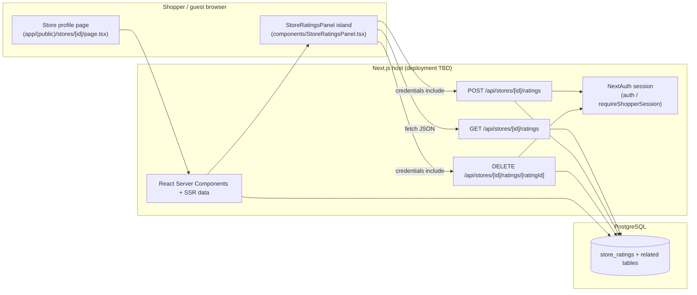
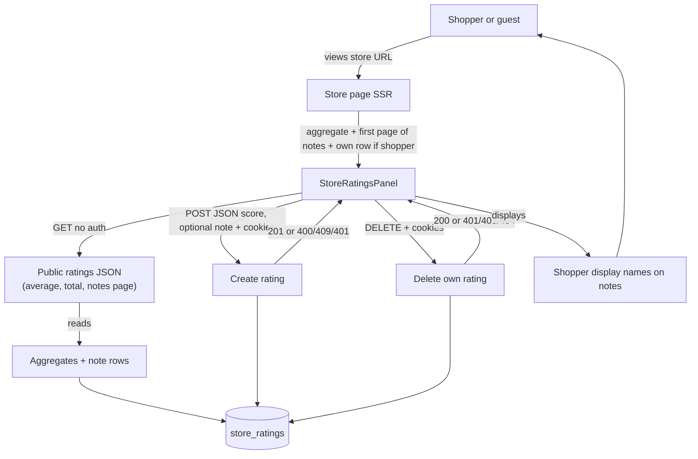
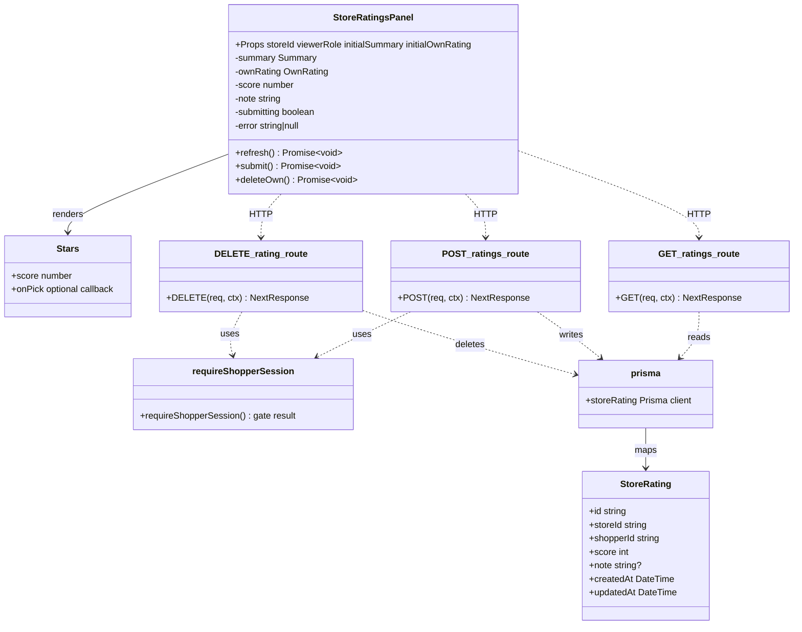

# Development specification: US15 — Shopper-facing store review or rating

## Primary and secondary owners

- **Primary:** AvalonMei (author of implementing PR [#126](https://github.com/gsha22/GrocerEase/pull/126); GitHub user [@AvalonMei](https://github.com/AvalonMei)).
- **Secondary:** gsha22 (reviewer / merge facilitator on the same PR thread; confirm on GitHub if a different assignee should be listed).

## Merge date

- **Merged to `main`:** `2026-04-20T02:47:01Z` (UTC), from merge commit `b158897` on `main` for **Merge pull request #126** (`feature/us-15-store-ratings`).
- **User story issue closed:** [#119](https://github.com/gsha22/GrocerEase/issues/119) — *US 15: Shopper-Facing Store Review or Rating* (`Closes #119` on PR #126).

## Architecture diagram (Mermaid)

## Information flow diagram (Mermaid)

## Class diagram (Mermaid)

## Classes in implementation

### `components/StoreRatingsPanel.tsx` (default export)

- **Public (component API):** `StoreRatingsPanel` — client island for ratings header, shopper gating, submit/delete flows, and recent-notes list.
- **Public types (module scope):** `RatingItem`, `Summary`, `OwnRating`, `Props` — shape of API/SSR payloads and props.
- **Public helpers:** `Stars` — renders read-only or clickable 1–5 star UI; `formatDate` — formats ISO timestamps for list rows.
- **Public methods (conceptual):** `refresh` — `GET /api/stores/:id/ratings` and updates `summary` / surfaces errors; `submit` — validates score, `POST` with JSON body, updates `ownRating`, calls `refresh`; `deleteOwn` — `DELETE` for current `ownRating.id`, clears `ownRating`, calls `refresh`.
- **Private (internal state):** `useState` for `summary`, `ownRating`, `score`, `note`, `submitting`, `error`; `useEffect` to sync props when `storeId` / SSR props change.

### `app/api/stores/[id]/ratings/route.ts`

- **Public:** `GET` — public aggregate (`average`, `total` over all ratings) plus paginated **note-bearing** ratings (`?page=`), `hasMore` from note count; `404` if store missing.
- **Public:** `POST` — requires shopper session via `requireShopperSession`; validates integer `score` 1–5 and optional `note` string length ≤ 280; `201` + `{ rating }`; `400` validation; `409` on unique violation (duplicate per store/shopper); `401` if not shopper.
- **Private:** Constants `PAGE_SIZE`, `NOTE_MAX`; Prisma `noteWhere` filter (non-null, non-empty note) for the feed.

### `app/api/stores/[id]/ratings/[ratingId]/route.ts`

- **Public:** `DELETE` — shopper-only; `404` if rating missing or wrong `storeId`; `403` if `shopperId` does not match session; `200` `{ ok: true }` on delete.

### `lib/require-shopper-session.ts`

- **Public:** `requireShopperSession()` — returns `{ ok: true, session }` or `{ ok: false, response }` with `401` JSON when session missing or role ≠ `shopper`.

### `app/(public)/stores/[id]/page.tsx` (relevant fragment)

- **Public (data loading):** Parallel Prisma queries for aggregate, note count, first page of note-bearing ratings, and optional `initialOwnRating` for logged-in shopper — passed into `StoreRatingsPanel`.

### `prisma/schema.prisma` — `StoreRating`

- **Public fields:** `id`, `storeId`, `shopperId`, `score`, `note`, `createdAt`, `updatedAt`; relations `store`, `shopper`; `@@unique([storeId, shopperId])`; index on `[storeId, createdAt desc]`.

### `tests/StoreRatingsPanel.test.tsx`

- **Public:** Jest + Testing Library suites asserting header, guest CTA, shopper submit/delete flows against mocked `fetch`.

## Technologies, libraries, and external APIs

| Technology | Version (from `package.json`) | Used for | Why chosen / notes | URL |
|------------|-------------------------------|----------|-------------------|-----|
| TypeScript | (via Next / project) | Typed UI, API routes, tests | Shared codebase typing | https://www.typescriptlang.org/ (Microsoft) |
| Next.js | ^16.2.1 | App Router, RSC, route handlers | Course stack; SSR for store page | https://nextjs.org/ (Vercel) |
| React / React DOM | 19.2.4 | UI components | Next peer dependency | https://react.dev/ (Meta) |
| Prisma | ^7.5.0 | ORM, migrations, queries | Type-safe DB access | https://www.prisma.io/ (Prisma Data) |
| @prisma/client / adapter-pg | ^7.5.0 | PostgreSQL driver integration | Production-style pooling | https://www.prisma.io/docs/orm/overview/databases/postgresql |
| PostgreSQL | (engine) | Persistent `store_ratings` | Relational integrity + CHECK | https://www.postgresql.org/ |
| NextAuth.js | 5.0.0-beta.30 | Session for shopper gate | Existing auth model | https://authjs.dev/ |
| bcryptjs | ^3.0.3 | (indirect) password hashing elsewhere | Not used directly in ratings routes | https://github.com/dcodeIO/bcrypt.js |
| Jest + Babel presets | ^30.x / ^7.29.x | Unit tests | `npm run test:jest` | https://jestjs.io/ |
| Testing Library (React / user-event / jest-dom) | ^16.3 / ^14.6 / ^6.9 | Component tests | Accessible queries | https://testing-library.com/ |

No third-party rating SaaS; ratings are first-party data in PostgreSQL.

## Database data types and storage

### Table `store_ratings` (Prisma `StoreRating`, `@@map("store_ratings")`)

| Field | Type (logical) | Purpose |
|-------|----------------|---------|
| `id` | UUID string | Primary key |
| `store_id` | UUID string | FK → `stores.id` (cascade delete) |
| `shopper_id` | UUID string | FK → `shoppers.id` (cascade delete) |
| `score` | INTEGER | 1–5 stars (app validation + DB `CHECK` per migration `20260419140000_store_ratings_score_check`) |
| `note` | TEXT nullable | Optional shopper tip, max 280 chars enforced in API |
| `created_at` | TIMESTAMP(3) | Sorting recent notes |
| `updated_at` | TIMESTAMP(3) | Prisma `@updatedAt` |

**Estimated bytes per row (order of magnitude):**

- `id` + `store_id` + `shopper_id`: 3 × 36 ASCII UUID strings ≈ 108 B on disk (plus TOAST/overhead; **Assumption:** compact text storage).
- `score`: 4 B.
- `note`: 0–280 Unicode chars — **Assumption:** average 80 chars UTF-8 ≈ 80 B; max ~280 × 4 B ≈ 1.1 KiB worst case if all 4-byte code points.
- Timestamps: 2 × 8 B ≈ 16 B.
- **Rough total:** ~200 B typical row to ~1.5 KiB with long notes + PostgreSQL tuple overhead.

Unique index `(store_id, shopper_id)` enforces one rating per shopper per store.

## Failure mode effects (frontend)

| Failure mode | User-visible effect | Internal / ops effect |
|--------------|---------------------|------------------------|
| Process crash (Node) | Error page or blank segment | Server restart; requests fail until healthy |
| Lost runtime state (client) | In-memory star pick / draft note lost | None persisted until POST succeeds |
| Erased stored data (DB restore) | Ratings disappear or revert | Backup/restore procedure required |
| Corrupt DB row (invalid score) | Mitigated by `CHECK (score BETWEEN 1 AND 5)` | Prisma errors on read/write; needs repair SQL |
| RPC failure (`fetch` to API) | `refresh` / submit / delete show `error` state; message suggests reload | HTTP 4xx/5xx logged in browser network tab |
| Client overload | Slow interactions; possible double-submit guarded partly by `submitting` flag | Rate limiting not in diff — **Assumption:** rely on hosting defaults |
| Client OOM | Rare; tab may hang | Large pages unrelated to small ratings payload |
| DB full | POST/DELETE/GET fail; user sees error toast copy from `fetch` path | Alerts on disk / quota |
| Network loss | Same as RPC failure | Offline no queue in diff |
| DB access loss | 500 from API | Prisma connection errors |
| Bot spam on POST | Duplicate or rapid creates blocked by unique constraint → 409 | May still create load; consider rate limits **Assumption:** future hardening |

## Personally Identifying Information (PII)

| PII | Why kept | How stored | Path into storage | Responsible party | Auditing |
|-----|----------|------------|---------------------|-------------------|----------|
| Shopper **display name** on public notes | Shown as `authorName` next to each note in GET/SSR | `shoppers.name` (existing model); not duplicated in `store_ratings` | `POST` → `shopperId` from session → relation load on `GET` / `findMany` select `shopper.name` | Team owning shopper profile data (confirm roster in course charter) | Routine: review DB exports for accidental broad sharing. Non-routine: incident response if notes contain harassment (content moderation policy **Assumption:** follow course / org policy). |
| Shopper **account id** (`shopper_id`) | Ties rating to account; used for authorization on DELETE | UUID in `store_ratings.shopper_id` | Session `user.id` on POST; compare on DELETE | Same as above | Access logs on admin tools if any (**Assumption:** minimal in MVP). |
| Optional **note** text | User-generated content; may include PII if shopper types it | `store_ratings.note` TEXT | Typed in `StoreRatingsPanel` → POST body | Content policy + GDPR-style deletion via shopper delete rating | Periodic review for abuse; shoppers can delete own row |

**Not stored in ratings row:** email, password (handled elsewhere).

## Minors and PII

- The feature does not **solicit age** on the ratings panel. If minors can register as shoppers (**Assumption:** follows general app signup rules), they could submit a rating or note; notes are public to guests once posted.
- **Guardian permission:** Not implemented in this diff — product/legal posture is an **Assumption:** inherits platform terms for shopper accounts.
- **Access by persons convicted/suspected of child abuse:** No special access path in this code; team policy is **Assumption:** institutional HR / compliance outside this repository.
