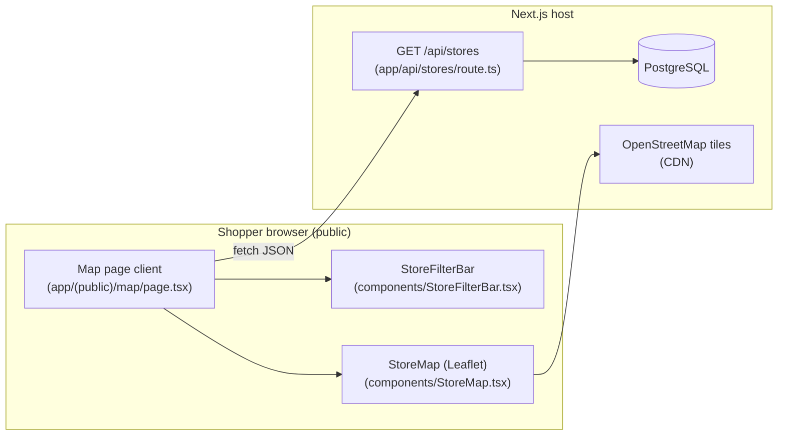
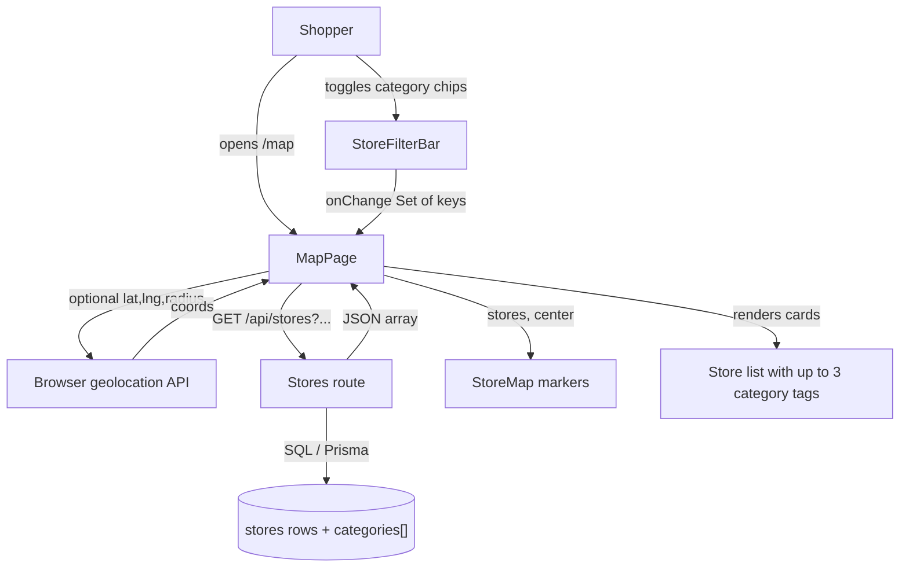
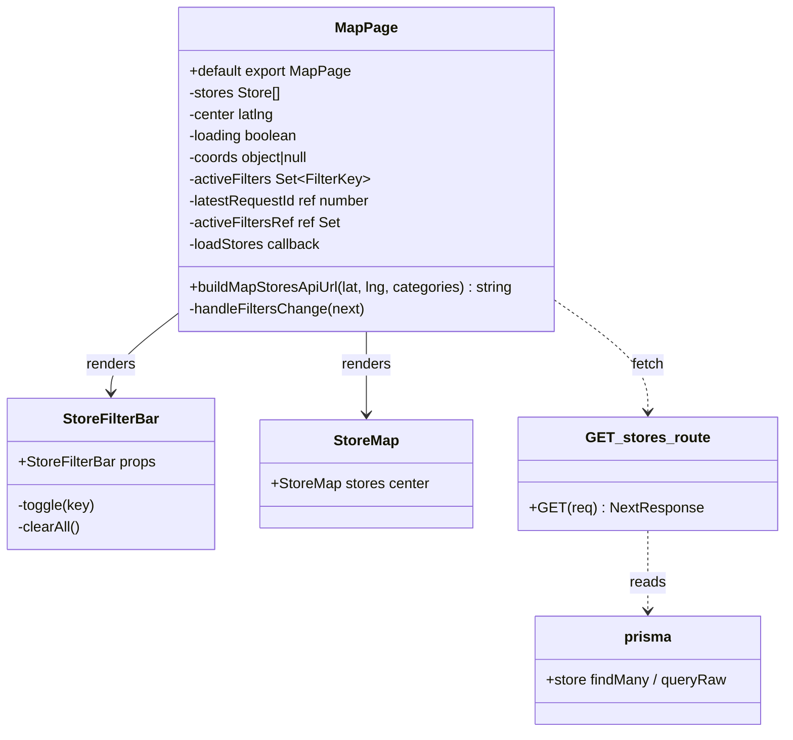

# Development specification: US16 — Map filter and map UI improvement

## Primary and secondary owners

- **Primary:** AvalonMei (author of implementing PR [#124](https://github.com/gsha22/GrocerEase/pull/124); GitHub user [@AvalonMei](https://github.com/AvalonMei)).
- **Secondary:** gsha22 (reviewer / merge facilitator on the same PR thread; confirm on GitHub if a different assignee should be listed).

## Merge date

- **Merged to `main`:** `2026-04-19T20:32:57Z` (UTC), from merge commit `889bede` on `main` for **Merge pull request #124** (`feature/us-16-map-filters`).
- **User story issue closed:** [#120](https://github.com/gsha22/GrocerEase/issues/120) — *US 16: Map Filter and Map UI Improvement* (`Closes #120` on PR #124).
- **Dev-spec automation tracking:** [#139](https://github.com/gsha22/GrocerEase/issues/139) — *US16: Dev Specs Automation*.

## Architecture diagram (Mermaid)

## Information flow diagram (Mermaid)

## Class diagram (Mermaid)

## Classes in implementation

### `app/(public)/map/page.tsx`

- **Public:** `buildMapStoresApiUrl(lat, lng, categories)` — builds relative URL for `fetch`: optional `lat`, `lng`, `radius=10`, and comma-separated `category=` from `Set<FilterKey>` (omitted when empty).
- **Public:** default export `MapPage` — client-only page (`"use client"`); composes filter bar, dynamic map, and store cards.
- **State:** `stores`, `center`, `loading`, `coords`, `activeFilters`.
- **Refs / concurrency:** `latestRequestId` increments per `loadStores` invocation; responses with stale `requestId` discard results before `setStores` / `setLoading`. `activeFiltersRef` mirrors `activeFilters` so geolocation callbacks use current filters.
- **Private helpers:** `loadStores` — `fetch` + JSON parse with guard; geolocation `useEffect` calls `loadStores` with `activeFiltersRef.current` on success/fallback.

### `components/StoreFilterBar.tsx`

- **Public:** `FILTER_OPTIONS`, type `FilterKey`, default export `StoreFilterBar` with `active: Set<FilterKey>` and `onChange(next)`.
- **Behavior:** toggles multi-select chips; “Clear all” resets set.

### `components/StoreMap.tsx`

- **Public:** Renders `react-leaflet` map with markers for each store; uses OSM tiles; unchanged contract beyond consuming filtered `stores` array from parent.

### `app/api/stores/route.ts` — `GET`

- **Public:** Reads `category` query (comma-separated, lowercased); optional `lat`, `lng`, `radius`; returns JSON array of stores with `distanceMiles` when geospatial query used.
- **Filtering:** After fetch, **AND** logic: every requested category token must match some entry in `store.categories` (case-insensitive). Empty filter list returns unfiltered (or distance-filtered) set; no matches yields `[]` with **200** OK.

### `tests/MapPageCategoryFilters.test.tsx`

- **Public:** Jest tests for URL builder, chip presence, refetch with `category=`, filtered empty-state copy; mocks `next/dynamic`, `next/link`, `fetch`, geolocation.

## Technologies, libraries, and external APIs

| Technology | Version (from `package.json`) | Used for | Why chosen / notes | URL |
|------------|-------------------------------|----------|-------------------|-----|
| Next.js | ^16.2.1 | App Router, client page | Same stack as rest of app | https://nextjs.org/ |
| React | 19.2.4 | UI state, effects | Peer of Next | https://react.dev/ |
| Leaflet | ^1.9.4 | Map rendering | Industry-standard slippy maps | https://leafletjs.com/ |
| react-leaflet | ^5.0.0 | React bindings for Leaflet | Declarative markers / tiles | https://react-leaflet.js.org/ |
| OpenStreetMap | (tile CDN) | Raster map tiles | Free basemap; attribution in `StoreMap` | https://www.openstreetmap.org/copyright |
| Prisma / PostgreSQL | ^7.5.0 | Store read path in API | Existing ORM + raw SQL for Haversine distance | https://www.prisma.io/ |
| Jest + Testing Library | ^30 / ^16 | Unit / component tests | `MapPageCategoryFilters.test.tsx` | https://jestjs.io/ |

## Database data types and storage

This story **does not** add tables or columns. Filtering uses existing **`stores`** rows:

| Field (relevant) | Type | Purpose for US16 |
|------------------|------|------------------|
| `categories` | `String[]` (PostgreSQL text array) | Matched against `?category=` tokens (AND, case-insensitive after trim/lower in route handler). |
| `lat` / `lng` | numeric | Map pins and Haversine distance when `lat`/`lng` query present. |
| `is_published` | boolean | Only published stores returned from API. |

**Estimated bytes (categories only, per store):** each tag string is short (e.g. `"asian"`); **Assumption:** 5 tags × ~15 UTF-8 bytes ≈ 75 B typical, bounded by product rules for specialty list.

## Failure mode effects (frontend)

| Failure mode | User-visible effect | Internal effect |
|--------------|---------------------|-------------------|
| Stale `fetch` response (race) | Mitigated: older `requestId` does not call `setStores` | Ordering guard in `loadStores` |
| Geolocation denied / unavailable | Falls back to `loadStores(null, null, filters)` | Pittsburgh default center until data loads |
| `/api/stores` 500 | Loading ends; list/map may stay empty | `console.error` on server |
| Empty filter match | “No stores match the selected filters.” when not loading and filters active | Legitimate 200 + `[]` |
| OSM / tile CDN outage | Gray map or broken tiles | Leaflet network errors in browser |
| Client offline | Spinner / stale data until timeout | `fetch` rejects; **Assumption:** no offline queue |
| Malformed JSON | Could break render | **Assumption:** rare; API returns array |

## Personally Identifying Information (PII)

US16 does **not** introduce new persisted PII. The map page is **public** (Story 12: no auth). Existing store **name** and **address** in API responses were already exposed on discovery surfaces; category chips only filter that data.

- **Coarse location:** Optional `lat`/`lng` query params reflect the shopper’s current position for distance sorting; they are **request-scoped** (not written to a new table by this story). Team responsible for API logging should avoid retaining query strings in long-lived logs (**Assumption:** follow org logging policy).

## Minors and PII

- No age gate on `/map`. Minors browsing the public map see the same store names/addresses as adults (**Assumption:** acceptable under general site terms).
- No additional guardian-consent flow in this diff. Team policy for minors follows platform-level rules outside this file.
