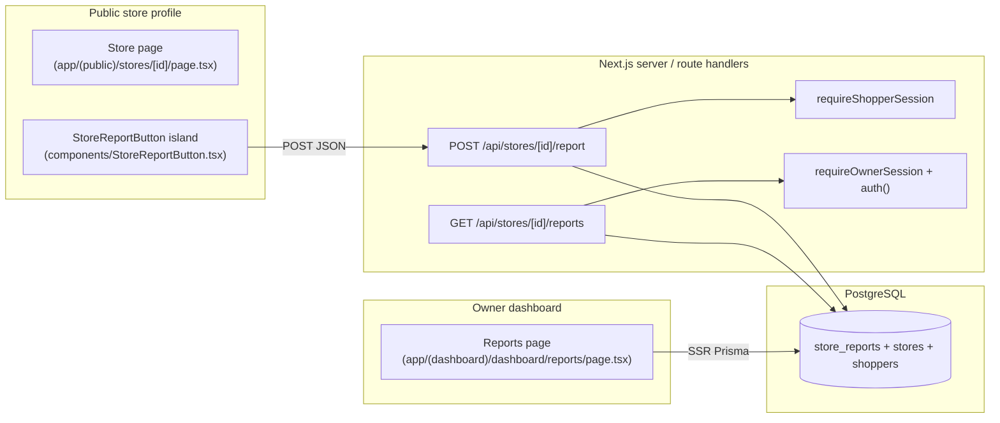
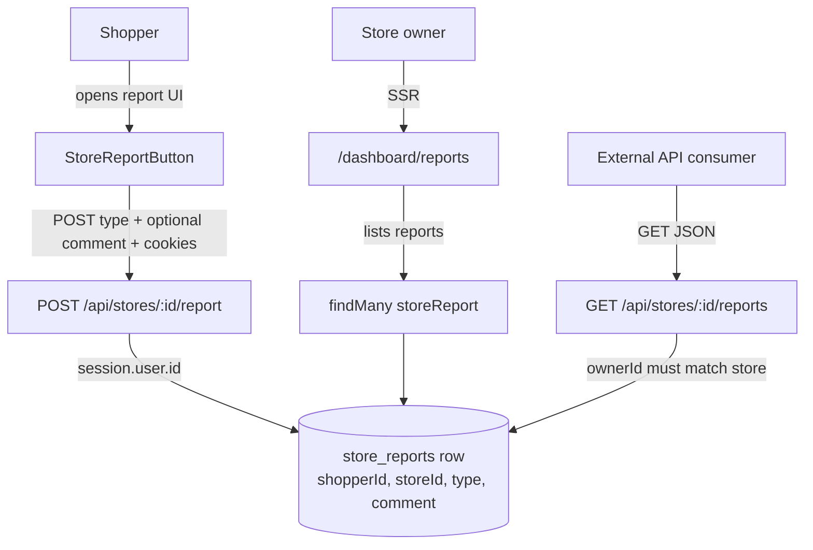
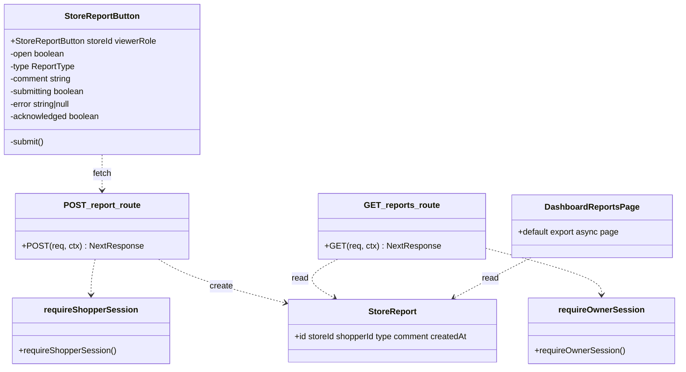

# Development specification: US17 — Shopper reports incorrect information

## Primary and secondary owners

- **Primary:** AvalonMei (author of implementing PR [#125](https://github.com/gsha22/GrocerEase/pull/125); GitHub user [@AvalonMei](https://github.com/AvalonMei)).
- **Secondary:** gsha22 (reviewer / merge facilitator on the same PR thread; confirm on GitHub if a different assignee should be listed).

## Merge date

- **Merged to `main`:** `2026-04-19T20:33:12Z` (UTC), from merge commit `d1d3c08` on `main` for **Merge pull request #125** (`feature/us-17-store-reports`).
- **User story issue closed:** [#121](https://github.com/gsha22/GrocerEase/issues/121) — *US 17: Shopper Reports Incorrect Information* (`Closes #121` on PR #125).
- **Dev-spec automation tracking:** [#141](https://github.com/gsha22/GrocerEase/issues/141) — *US17: Dev Specs Automation*.

## Architecture diagram (Mermaid)

## Information flow diagram (Mermaid)

## Class diagram (Mermaid)

## Classes in implementation

### `components/StoreReportButton.tsx`

- **Public:** Default export — lightweight report control on the store profile; gated to `viewerRole === "shopper"` (others see sign-in CTA with `callbackUrl`).
- **State:** `open`, `type` (`out_of_stock` \| `incorrect_hours` \| `wrong_price` \| `other`), `comment`, `submitting`, `error`, `acknowledged`.
- **Behavior:** `submit()` → `POST /api/stores/${storeId}/report` with JSON `{ type, comment? }`; on success shows acknowledgement banner; on failure shows server `error` text (including 429 duplicate message).

### `app/api/stores/[id]/report/route.ts`

- **Public:** `POST` — `requireShopperSession`; validates `type` against `REPORT_TYPES`; optional `comment` string, max 280 chars; `404` if store missing; **Serializable** Prisma transaction: find recent report for same `(storeId, shopperId)` within 24h → if found return **429** with friendly copy; else `create` and return **201** `{ report }`. Catches Prisma **P2034** (serialization failure) and maps to same **429** body.

### `app/api/stores/[id]/reports/route.ts`

- **Public:** `GET` — `requireOwnerSession`; loads store by `storeId`; **403** if `store.ownerId !== session.user.id`; else returns JSON `{ reports }` (up to 100 rows, `id`, `type`, `comment`, `createdAt`).

### `app/(dashboard)/dashboard/reports/page.tsx`

- **Public:** Server component; `auth()` then **redirect** to `/login` if not `role === "owner"`; loads owner’s single store (by `ownerId`) and `storeReport.findMany` for that `storeId`; empty state if no store profile or no reports; maps enum to human-readable `TYPE_LABELS`.

### `prisma/schema.prisma` — `StoreReport` + `StoreReportType`

- **Fields:** `id`, `storeId`, `shopperId`, `type` (`StoreReportType` enum), `comment` optional, `createdAt`; FKs to `Store` and `Shopper` with cascade delete; indexes on `(storeId, createdAt)` and `(shopperId, storeId, createdAt)` for listing and duplicate window queries.

### `components/Sidebar.tsx`

- **Change:** Adds navigation entry `{ href: "/dashboard/reports", label: "Reports", ... }` for owners.

### `tests/StoreReportButton.test.tsx`

- **Public:** Jest + Testing Library coverage for CTA gating, submit flow, acknowledgement, and 429 error surfacing.

## Technologies, libraries, and external APIs

| Technology | Version (from `package.json`) | Used for | Why chosen / notes | URL |
|------------|-------------------------------|----------|-------------------|-----|
| Next.js | ^16.2.1 | App Router, RSC dashboard, route handlers | Course stack | https://nextjs.org/ |
| React | 19.2.4 | `StoreReportButton` client island | Standard UI | https://react.dev/ |
| Prisma | ^7.5.0 | Migrations, ORM, **Serializable** transactions | Duplicate-safe check-and-insert | https://www.prisma.io/ |
| PostgreSQL | (engine) | `store_reports`, enums | ACID + enum type for report `type` | https://www.postgresql.org/ |
| NextAuth.js | 5.0.0-beta.30 | `auth()` session roles | Existing shopper/owner split | https://authjs.dev/ |
| Jest + Testing Library | ^30 / ^16 | Component tests | `StoreReportButton.test.tsx` | https://jestjs.io/ |

No external reporting SaaS; data stays in the app database.

## Database data types and storage

### Table `store_reports` (Prisma `StoreReport`)

| Field | Type | Purpose |
|-------|------|---------|
| `id` | UUID text | Primary key |
| `store_id` | UUID text | FK → `stores.id` |
| `shopper_id` | UUID text | FK → `shoppers.id` (reporter) |
| `type` | `StoreReportType` enum | `out_of_stock`, `incorrect_hours`, `wrong_price`, `other` |
| `comment` | TEXT nullable | Free text, max 280 chars enforced in API |
| `created_at` | TIMESTAMP(3) | Ordering + 24h duplicate window |

**Estimated bytes per row:** id + two FK UUIDs ≈ 108 B; enum small; comment 0–280 chars UTF-8 **Assumption:** ~50–400 B typical; timestamps ~16 B; **order of magnitude ~200 B–1 KiB** with long comments + PostgreSQL overhead.

## Failure mode effects (frontend)

| Failure mode | User-visible effect | Internal effect |
|--------------|---------------------|-----------------|
| `POST` 401 | Error text from JSON / sign-in CTA for wrong role | Session missing or not shopper |
| `POST` 429 | Friendly “already reported…24 hours” | Dedupe path or serialization conflict |
| `POST` 400 / 404 | Validation or “Store not found” | Bad `type` or unknown `storeId` |
| Network loss | “Could not submit report.” | `fetch` rejection |
| Owner opens `/dashboard/reports` unauthenticated | Redirect to `/login` | `redirect()` in server component |
| Wrong owner calls `GET /api/stores/:id/reports` | 403 JSON | `store.ownerId` mismatch |
| DB / Prisma error | 500 or error boundary | Logs / ops alert |
| High concurrency on duplicate POST | Second request gets 429 (P2034 or null report) | Serializable transaction |

## Personally Identifying Information (PII)

| PII | Why kept | How stored | Path | Responsibility | Auditing |
|-----|----------|------------|------|------------------|----------|
| **Shopper id** (`shopper_id`) | Ties report to account; duplicate window per shopper/store | UUID FK in `store_reports` | Session on `POST` → Prisma `create` | Team owning auth/shopper data | Access restricted to DB + app; owners do **not** see shopper id in dashboard UI (list is type/comment/time only). |
| **Free-text `comment`** | User-provided context; may include accidental PII (phone, name) | `store_reports.comment` TEXT | `StoreReportButton` textarea → `POST` body | Content policy; consider moderation backlog **Assumption:** course-scale manual review |
| **Store id** | Scopes report | FK | URL param | Standard |

Owner dashboard copy frames reports as **hints** and does not surface reporter display name in the shipped UI described in the PR (**Assumption:** aligns with “lightweight” trust product goal).

## Minors and PII

- Shoppers who are minors could submit comments; no extra age check in this diff (**Assumption:** inherits signup / terms).
- **Guardian consent:** Not implemented here.
- **Access by restricted persons:** No special handling in code; organizational policy applies outside this repository.
